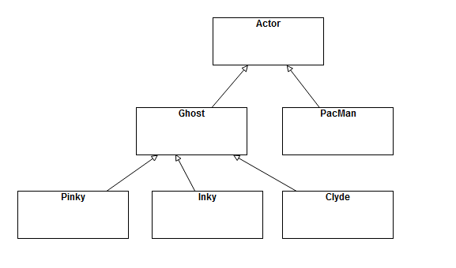
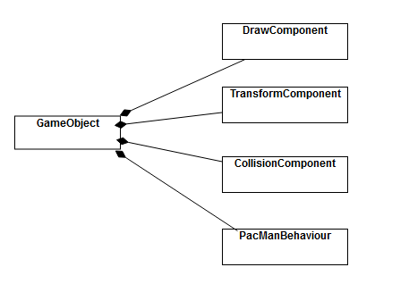

# 第二章 游戏对象和 2D 图形

## 2.1 游戏对象

&emsp;&emsp;在第一章中，两个乒乓球拍之间有着共同的特性，如果考虑多个乒乓球的话，他们之间也有共同的特性。同时它们都有使用到速度和位置的描述，因此，与其像第一章直接把乒乓球和乒乓球拍写死，不如让它们成为**游戏对象(game object)**。游戏对象是指在游戏世界中进行更新，产生输出或者两者都有的各种事物。游戏对象可以有多种实现方式，可以采用对象层次结构，也可以采用组成结构。无论如何，它们要完成的任务都是一样的。

### 2.1.1 游戏对象的类型

&emsp;&emsp;最常见的游戏对象是在游戏循环**更新游戏世界**的阶段进行每一帧的更新，在**生成输出阶段**进行每一帧的绘制。
&emsp;&emsp;有时，开发人员会称游戏中不会更新的对象称为**静态对象**，比如 Phong 中的墙壁。会动的称为动态对象，比如各种游戏中的角色与怪兽。
&emsp;&emsp;相机(camera)是一种会进行更新，但是不会被绘制的一种游戏对象。而很多游戏中的天空盒(sky box)，则是只会被绘制，不会更新的游戏对象。

### 2.1.2 游戏对象模型

&emsp;&emsp;有很多游戏对象模型，它们或多或少都有些独特的优缺点，我们自研引擎的时候，应当进行相应的权衡。
&emsp;&emsp;为了讲解一些常用游戏对象模型，我们采用吃豆人的例子进行讲解。

<div align = "center" >

<h4>吃豆人</h4>
</div>

#### 作为类层次结构的游戏对象

&emsp;&emsp;这种模式的思想是：在标准面向对象的层次结构中，声明游戏对象。用于所有使用的游戏对象都继承自一个基本类，因此有时候这种面向对象类层次结构也被成为**单一整体**层次结构。

&emsp;&emsp;要使用这一种模型，首先需要一个基本的类:

```c++
class Actor
{
    // called every frame to update Actor
    virtual void Update(float deltaTime);
    // called every frame to draw the actor
    virtual void Draw();
}
```

&emsp;&emsp;然后，在这个基本类上根据不同的角色我们实现不同的子类。

```c++
class PacMan : public Actor{
    public:
        void Update(float deltaTime) override;
        void Draw() override;
}
```

&emsp;&emsp;我们暂时不考虑鬼之间的差异具体有多少，我们将吃豆人中的每个鬼视作一个类,于是吃豆人的层次结构可以如下描述。

<div align = "center" >

<h4>吃豆人层次结构</h4>
</div>

&emsp;&emsp;这个方法能够一层一层拓宽游戏对象的功能，但是这样也会导致我们加入很多不必要的功能。比如一个固定视角的游戏，我们不需要对墙相关的游戏对象进行更新只需要绘制；不需要对触发器(trigger)进行绘制，但是只需要刷新。

&emsp;&emsp;当我们使用这种游戏对象模型的时候，请尽可能避免出现**钻石型继承**。

#### 具有组件的游戏对象

&emsp;&emsp;许多游戏都使用**基于组件**的游戏对象模型来取代单一的整体式层次结构。Unity 引擎是采用这种思路的一个典型。在这个模型中，游戏对象类是一个组件的容器，组件负责完成各种功能，而容器负责组织组件。

&emsp;&emsp;在这种模式下，我们可以将 PacMan 理解为包含 TransformComponent, CollisionComponent, RendererComponent 和 PacManBehavior 这些组件的一个 GameObject 对象。

<div align = "center" >

<h4>吃豆人组件结构</h4>
</div>

&emsp;&emsp;对于纯粹的组件结构，GameObject 只提供添加与删除组件的方法与相关数据结构，不会提供任何其它功能。

```c++
class GameObject{
    public:
        AddComponent(Component*);
        RemoveComponent(Component*);
    private:
        std::unorder_set<Component*> mComponents;
}
```

&emsp;&emsp;基于组件的游戏对象模型可以更容易地将功能只添加到需要它的特定游戏对象中,而不会添加不需要的功能。比如只有需要被绘制的对象才会添加 RendererComponent 组件。

&emsp;&emsp;但是这个模式的缺点也很明显，当我们绘制场景中的物品时，我们往往需要获取 Transform 的信息，这意味着 RendererComponent 的实现必须要通过 GameObject 查询获取 Transform。根据查询方式的不同，查询操作可能成为性能瓶颈。

#### 具有组件层次结构的游戏对象

&emsp;&emsp;在实际应用中，往往上述两种模式结合使用。我们将一些额外必要的内容放入 GameObject 中，然后提供管理各种组件的容器。在本章，类的声明如下:

```c++
#include<vector>
using namespace std;
	class GameObject
	{
	public:

		// track state of gameobject
		enum State{
			EActive,
			EPause,
			EDead
		};

		// constructor and destructor
		GameObject(class Game* game);
		virtual ~GameObject();

		// add and remove gameobject
		void AddComponent(class Behaviour* behaviour);
		void RemoveComponent(class Behaviour* behaviour);

		//Getters/Setters
		//...

		//update method called from game
		void Update(float deltaTime);
		//update all components attached to the game object
		void UpdateComponents(float deltaTime);
        //any specific update code
		virtual void UpdateGameObject(float deltaTime);

	private:
		// gameObject's state
		State mState;
		// transform informations
		class Transform* mtransform;
		// components container
		vector<class Behaviour*> mComponents;
		class Game* game;
	};


```

&emsp;&emsp;GameObject 类会有多种状态，包括活跃、暂停以及死亡，在上述代码分别对应"EActive,EPause,EDead"。我们只更新参与 EActive 状态的对象，处于 EPause 状态的对象将会在不被进行任何更新(包括绘制)，对于 EDead 状态的对象会通知游戏将它删除。

&emsp;&emsp;Update 方法首先会调用 UpdateComponents 方法对所有活动组件进行遍历更新。为了使得 GameObject 的子类能够自定义行为，因此提供了 UpdateGameObject 方法让子类自定义更新行为。但是对于 GameObject 的对象，这个实现为空。

&emsp;&emsp;在游戏过程中，GameObject 对象会不可避免地用到 Game 对象中的各种内容，比如使用 deltaTime，创建新的游戏对象等。一个解决方案是使用**单例模式**，将 Game 对象变成一个单例。但是我们需要考虑游戏中的游戏的情况，因此我们可能不止一个 Game 类。所以我们不使用单例模式，而是使用一种叫**依赖注入**的方法，让 GameObject 的构造需要用到 Game 对象的指针。

&emsp;&emsp;我们将游戏对象的位置信息封装到了 Transform 类，这个类记录了游戏对象的位置，旋转，缩放等内容。现在只以最简单的方式将其进行实现,会在之后的章节中陆续更新完善。

```c++
class Transform
{
	public:
		Vector2 scale;
		Vector2 position;
		float rotation;
};
```

&emsp;&emsp;接下来我们进行组件类(Behaviour)的声明。在这个类中，我们声明了一个很重要的变量，mUpdateOrder。这个会决定在 GameObject 中，对 Component 进行更新的顺序。比如我们往往希望在别的的内容完成了更新后，再进行绘制；在游戏对象移动后再启用相机。

```c++
class Behaviour
{
public:
	// constructor and destructor
	Behaviour(class GameObject* gameObject, int updateOrder = 100);
	virtual ~Behaviour();
	int GetUpdateOrder() const;
private:
	int mUpdateOrder;
	class GameObject* gameObject;
};
```

&emsp;&emsp;这种混合模型可以避免单一整体对象模型中过于深层次的结构，其层次性也比纯组件模型让其有了更大的拓展空间。虽然不能完全消除组件间的通讯问题，但是我们能够尽可能进行避免。

&emsp;&emsp;目前为止，我们并没有让 GameObject 或者 Behaviour 进行输入的处理。这一章节暂时不考虑这个问题，使用特殊的方式进行处理。在第三章将会重新讨论如何将输入合并到游戏对象模型中。

### 2.1.3 将游戏对象加入循环

&emsp;&emsp;在游戏循环中，我们创建的 GameObject 对象，在完成创建后不能马上加入游戏循环，因为这个过程可能发生在游戏循环的任何位置从而导致一些不确定的行为。同理，我们也不应该直接将不需要的 GameObject 立即删除。因此，在 Game 类中，我们需要特定的容器对 GameObject 的创建与销毁进行管理。

&emsp;&emsp;在这里我们创建三个向量容器，分别用于管理挂起，活跃，死亡状态的 GameObject。游戏更新只遍历更新在 activeList 中的 GameObject。在创建游戏对象后，新加入的游戏对象会加入 pendingList 中，在完成了对 activeList 的操作后，才将 pendingList 中的对象加入 activeList。而在每一次更新的最后，逐个销毁 deadList 中的 GameObject 对象。

```c++
using namespace std;
struct WindowSize {
	int w, h;
};
class Game
{
public:
	Game();
	// initialize a game
	bool Initialize();
	// runs game loop until game is over
	void GameLoop();
	void Shutdown();
	// create new GameObject
	void CreateGameObject(string name = "GameObject");
	// remove GameObject
	void RemoveGameObject(class GameObject*);

private:
	void ProcessInput();
	void UpdateGame();
	void GenerateOutput();

	// game should continue running
	bool mIsRunning;
	// we use this render draw the graphics
	SDL_Renderer* mRenderer;
	// window created by SDL
	SDL_Window* mWindow;
	// record our client window size
	WindowSize mWindowSize;
	// record time count since last frame
	Uint32 mTicksCounts;

	vector<class GameObject*> activeList;
	vector<class GameObject*> pendingList;
	vector<class GameObject*> deadList;
};

```

&emsp;&emsp;Game 其他大体上的内容见上一章节，在这一章节中我们需要着重对 GameLoop 中的 UpdateGame 和 GenerateOutput 进行修改，GenerateOutput 稍后会提到。

```c++
void Game::UpdateGame() {

	// Calculate delta time
	Uint32 expectCounts = mTicksCounts + 16;
	while (SDL_GetTicks() < expectCounts);// wait until 16 ms pass
	float deltaTime = (SDL_GetTicks() - mTicksCounts) / 1000.0f; //it stores counts of ms
	mTicksCounts = SDL_GetTicks();
	deltaTime = min(deltaTime, 0.5f);

	for (auto it = activeList.begin(); it != activeList.end(); it++) {
		(* it)->Update(deltaTime);
	}

	for (auto it = pendingList.begin(); it != pendingList.end(); it++) {
		activeList.emplace_back(*it);
	}

	for (auto it = deadList.begin(); it != deadList.end(); it++) {
		delete (*it);
	}
	deadList.clear();
}
```
