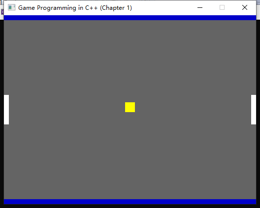
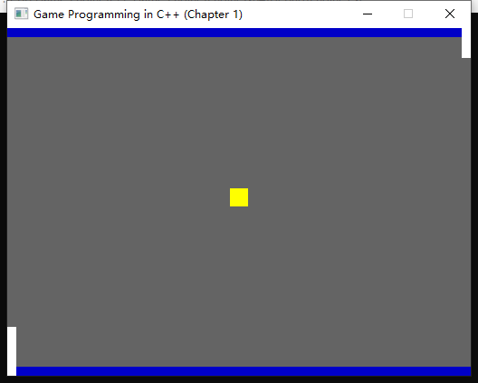

# 第一章 游戏编程概述

## 前言

&emsp;&emsp;在这一章，将会学习关于游戏循环的知识，给出一个 Game 类最基本的结构，并且会学习基础的 SDL 库的使用，在最后我们也会一步一步制作一个最基础的 Phong 游戏。因为只是初步的学习，因此这一章的代码不会太注重架构问题，因此当我们写完代码后，会发现我们的结构很乱。我的代码即使是优化过了我看起来还是感觉乱。但是这一章的核心内容是了解游戏循环的基本理念，以及熟悉 SDL 的基础操作。更加合理的引擎代码架构将会在后面的章节讨论。

## 1.1 使用到的 C++ 以外的库

&emsp;&emsp;在第一章中，除了 C++的标准库以外，也需要用到 [SDL 库](https://github.com/libsdl-org/SDL/releases) 和配套的 [SDL_Image 库](https://github.com/libsdl-org/SDL_image/releases)。SDL 库是一个 C 语言编写的跨平台游戏开发库，支持包括创建窗口、2D 图像、输入输出、音频处理等常用游戏功能。同时这个库也是后期游戏会用到的主要的库。对于不熟悉 VS 的同学，它们配置起来有点痛苦，不过算是我们开始的第一步。

## 1.2 关于游戏循环

&emsp;&emsp;游戏在运行过程中属于循环的过程，只要游戏在运行，那么每一秒都需要对游戏中的各种逻辑进行多次更新。只要玩家没有退出游戏，那么游戏的循环将不会退出。

&emsp;&emsp;每一次游戏循环都是一帧，大多数游戏每秒会运行 30 到 60 帧，这就说明了我们的游戏逻辑将会在一秒内循环 30 或 60 次。这种高频率的游戏更新，将会给玩家带来画面连续运动的感觉。我们通常用**帧率**来描述每秒中游戏的循环次数。

&emsp;&emsp;在每一次游戏循环中（每一帧），游戏循环需要处理以下内容：

1. 处理来自外部的输入
2. 更新游戏世界各种信息
3. 输出内容

&emsp;&emsp;第一个步骤，处理来自外部的输入。这个不一定只是键盘鼠标的输入，如果你的引擎还考虑别的平台设备，比如手柄等，你也必须能处理，即**你必须确保你能够能检测各种来自你引擎支持的设备的输入**。同时在网络游戏中，输入包括了**各种来自互联网的输入**，比如用于帧同步的 UDP 数据报。

&emsp;&emsp;第二个步骤，更新游戏世界。这个指的是在每一次游戏循环中都要仔细检查游戏中的各个对象，并且按照代码的逻辑将对象的各种属性进行更新，比如 transform(中文名变换,这是一种用于计算机描述一个对象在空间中的属性，包括缩放，位置，旋转等，因为变换这个词太过直译因此之后统一使用 transform)、颜色等。这些对象包括代码循环中的功能性对象，比如时钟，对象池等，这些往往是不可见的；以及具体游戏中的各个自定义对象，比如游戏中的人物，UI，场景等。

&emsp;&emsp;最后一个步骤，输出。作为一个游戏，最重要的就是输出图像，同时也可能伴随着音效震动等额外反馈。

&emsp;&emsp;综上，整个流程伪代码如下：

```C++
    void Game::GameLoop()
    {
        if(!mShouldQuit)//如果不需要退出
        {
            HandleInput();//接受与处理输入
            UpdateGame();//根据输入与代码逻辑更新游戏中的对象
            GenerateOutput();//产生输出，
        }
    }
```

&emsp;&emsp;对于以前的游戏来说，游戏能够刚刚好在一定的时间内完成它的所有更新并且输出，但是随着现在 CPU 等硬件的进步，不能再像以前直接通过写一定时间复杂度的代码控制循环，我们需要用到系统时间来帮我们更好地执行循环。利用系统时间还有个好处，允许我们通过获取两帧之间的时间差来调整 UpdateGame 的频率以尽可能消除游戏在不同设备上游戏循环的差异。而这些会在稍后讲到。

&emps;&emps;Unity 的 MonoBehaviour 生命周期就是一个比较著名是游戏循环。[Unity MonoBehaviour](!https://docs.unity3d.com/Manual/ExecutionOrder.html)

## 1.3 Game 类骨架

&emsp;&emsp;我们现在先制作一个 Game 类的骨架，这个骨架应该包括以下内容：

1. 前文提到的各种游戏循环应该处理的方法声明。
2. 允许开始与结束游戏。
3. 创建游戏窗口。

因为使用到了 SDL 提供创建窗口的功能，因此我们需要引用 [SDL 库](https://github.com/libsdl-org/SDL/releases)。#include<SDL.h>

```c++
#include <SDL.h>
class Game
{
public:
	Game();
	// initialize a game
	bool Initialize();
	// runs game loop until game is over
	void GameLoop();
	void Shutdown();

private:
	void ProcessInput();
	void UpdateGame();
	void GenerateOutput();
	// window created by SDL
	SDL_Window* mwindow;
	// game should continue running
	bool mIsRunning;
};

```

&emsp;&emsp;Game 对象的初始化不需要做什么事情，把 mIsRunning 设置为 true，mwindow 设置为 nullptr 就好。

```c++
Game::Game() {
	mwindow = nullptr;
	mIsRunning = true;
}
```

### Game::Initialize()方法

&emsp;&emsp;这个方法我们用来进行项目的初始化，它要做的工作即创建游戏窗口。

```c++
bool Game::Initialize() {
	// We use it to initialize video system, it returns 0 if unable to initialize
	int sdlResult = SDL_Init(SDL_INIT_VIDEO);
	if (sdlResult != 0) {
		SDL_Log("Unable to initialize the game");
        return false;
	}
    ...
	return true;
}

```

&emsp;&emsp;SDL_Init()这个函数接受一个单一参数(标志位)来初始化对应子系统，而我们在这里初始化的就是视频子系统。这个方法的返回值为一个整数，如果返回值不为 0 的话，那么说明此次创建失败。

&emsp;&emsp;常用子系统包括。

1. SDL_INIT_AUDIO 初始化音频子系统
2. SDL_INIT_VIDEO 初始化视频子系统，其可以连接 OpenGL 库和 2D 图形库
3. SDL_INIT_HAPTIC 力反馈子系统
4. SDL_INIT_GAMECONTROLLER 输入设备子系统

我们可以通过或位运算标志一次创建多个子系统，即

```c++
int sdlResult = SDL_Init(SDL_INIT_VIDEO|SDL_INIT_AUDIO|SDL_INIT_HAPTIC|SDL_INIT_GAMECONTROLLER);
```

&emsp;&emsp;接下来就是创建具体的窗口。

```c++
	mWindow = SDL_CreateWindow(
		"Game Programming in C++ (Chapter 1)", // window title
		100,//top left x-coordinate of window
		100,//top let y-coordinate of window
		1024,//width of window
		768,//height of window
		0// flag
	);

	if (mWindow == nullptr) {
		SDL_Log("Unable to create window");
		return false;
	}
```

&emsp;&emsp;SDL_CreateWindow()函数接受的参数包括窗口的名称（通常就是游戏名），左上角坐标，窗口大小，以及窗口创建标志。
&emsp;&emsp;窗口标志用于配置一些窗口的属性，当我们把窗口标志设置为 0 的时候，窗口不会有任何特别。常用标志包括以下内容:

1. SDL_WINDOW_FULLSCREEN 全屏进行游戏
2. SDL_WINDOW_FULLSCREEN_DESKTOP 在当前桌面分辨率下使用全屏模式(忽视 CreateWindow 的其它参数)
3. SDL_WINDOW_OPENGL 添加对 OpenGL 库的支持
4. SDL_WINDOW_RESIZEABLE 允许用户调整窗口大小

&emsp;&emsp;同前面的创建子系统，也允许使用或位运算一次性开启多个标志。虽然很多游戏都是全屏，玩起来也爽，但是这样不利于开发者的调试。
&emsp;&emsp;整个 Initialize 的代码如下:

```c++
bool Game::Initialize() {
	// We use it to initialize video system, it returns 0 if unable to initialize
	int sdlResult = SDL_Init(SDL_INIT_VIDEO);
	if (sdlResult != 0) {
		SDL_Log("Unable to initialize the game");
		return false;
	}

	mWindow = SDL_CreateWindow(
		"Game Programming in C++ (Chapter 1)", // window title
		100,//top left x-coordinate of window
		100,//top let y-coordinate of window
		1024,//width of window
		768,//height of window
		0// flag
	);

	if (mWindow == nullptr) {
		SDL_Log("Unable to create window");
		return false;
	}
	return true;
}
```

### Game::Shutdown 方法

&emsp;&emsp;Shutdown 方法和 Initialize 方法相反，Shutdown 方法只要你销毁掉 SDL_Window，关闭 SDL 库，结束游戏循环即可。

```c++
void Game::Shutdown() {
	SDL_DestroyWindow(mWindow);
	SDL_Quit();
	mIsRunning = false;
}
```

### Game::GameLoop 方法

&emsp;&emsp;GameLoop 方法具体该干什么已经在游戏循环中讲了，我们暂时不实现它里面的三个方法，即给这几个方法的代码段中留空。

```c++
void Game::GameLoop() {
	while (mIsRunning) {
		ProcessInput();
		UpdateGame();
		GenerateOutput();
	}
}

void Game::ProcessInput() {}
void Game::UpdateGame() {}
void Game::GenerateOutput() {}
```

### main 函数

&emsp;&emsp;c++所有函数的入口都是 main 函数，main 函数构造一个 Game 类的实例，然后调用实例的 Initialize 方法来运行游戏。因为现在我们什么都没做，因此现在运行后如果能够出现一个白色窗口的话（macOS 可能是黑色，如果用 VS 运行那会出现一个黑色的 debug 窗口，这个不是我们要的），那么说明环境配置是没问题了。现在的窗口我们没办法直接操作，只能通过结束程序运行来关闭，还是挺难受的。这个将会在马上讲到的 ProcessInput 中解决。

&emsp;&emsp;题外话，VS 的配置对于不熟悉 VS 的同学还是挺难受的，但是这个是非常重要的工作。

```c++
#include "Game.h"
using namespace std;
int main(int argc, char** argv) {
	Game game;
	bool success = game.Initialize();

	if(success)		game.GameLoop();
	return 0;
}
```

### Game::ProcessInput()

&emsp;&emsp;现在的 main 函数的窗口其实是很令人难受的，因为现在我们没办法把它进行移动与关闭。这是 ProcessInput()要做的事情之一。当玩家进行一些输出操作后，操作系统会发出相关的事件，这个函数的本质就是让我们的程序处理特定的事件。

&emsp;&emsp;SDL 库管理一个从操作系统接受事件的内部队列，这个队列包含许多不同窗口操作的事件，以及输入设备相关的事件。对于每一帧，游戏必须轮询这些队列中的事件，并且选择性忽略或处理一些事件。

&emsp;&emsp; ProcessInput()的基本结构如下:

```c++
void Game::ProcessInput() {
	SDL_Event event;// it is a general structure of event

	// SDL_PollEvent assign the event and return true if there is event(+
	while (SDL_PollEvent(&event)) {
		switch (event.type) {
			//handle different input here
		}
	}

```

&emsp;&emsp;SDL_event 是 SDL 定义的输入事件的结构体，SDL_PollEvent 这个函数会从输入队列里面获取当前输入，并且将其赋值给 event。注意这个函数要求传入的参数是有个指针，因为指针的名字本质就是指针所指向的地址，因此我们传入的是 event 变量的地址(&event)。当能够从输入队列获取到事件的时候，SDL_PollEvent 函数将会返回 true，于是我们就开始对输入队列进行轮询，并且针对性地处理输入。

&emsp;&emsp;我们现在先来处理窗口的关闭操作。

```c++
void Game::ProcessInput() {
	SDL_Event event;// it is a general structure of event

	// SDL_PollEvent assign the event and return true if there is event
	while (SDL_PollEvent(&event)) {
		switch (event.type) {
		case SDL_QUIT:
			mIsRunning = false;
			break;
		}
	}
	//Unit8 is a SDL defined 8 bits unsigned short
	const Uint8* state = SDL_GetKeyboardState(NULL);
	if (state[SDL_SCANCODE_ESCAPE]) {//when press escape, stop game
		mIsRunning = false;
	}

}
```

&emsp;&emsp;当我们点击窗口的 × 的时候，游戏就会收到 SDL_QUIT 的事件，这个时候我们就可以选择结束游戏循环了。之所以我们使用 break 而非 return，是为了防止后面可能有别的操作不能被打断，比如这段代码后面还需要处理按键事件。

&emsp;&emsp;Uint8 是 SDL 定义的一种 8bit unsigned int 类型，而 SDL\*GetKeyboardState 这个函数则是返回的这个类型的数组(C/C++中，数组本质就是指针)。SDL 将各个按键对应成了 int 类型常量，比如 SDL_SCANCODE_ESCAPE 值是 41，当当前帧获得键盘输入时，数组的对应位置将会是 1,否则为 0。SDL 将所有按键输入对应到 SDL_SCANCODE\_前缀的常量中，因此查看按键状态的时候，我们应该使用对应的常量进行访问。

&emsp;&emsp;SDL_GetKeyboardState()中的传参要求是 int 指针类型，它将会把对应的指针赋值为返回数组的长度，传入 NULL 表示不需要获得长度。**SDL_GetKeyboardState 返回的数组(指针)是在整个程序生命周期都有效的，因此我们不能释放它的空间。**，这也同时表明了，我们不需要考虑它的越界问题。

&emsp;&emsp;SDL_GetKeyboardState 返回的数组是当前键盘状态的快照，如果我们需要刷新快照的话，需要用到 SDL_PumpEvents()函数。但是因为 SDL_PollEvent 这个函数隐式调用了这个函数，因此我们不需要单独调用。

## 1.4 基本的 2D 图像

&emsp;&emsp;从最简单的开始，我们会在这一章节结束制作一个简单但是有名气的 2D 乒乓球游戏 Phong。先别急着 3D，2D 图像都没搞清楚就去碰 3D 是不现实的，因此我们需要先了解 2D 图形是怎么样服务于游戏的。

&emsp;&emsp;现在绝大多数的显示器都是使用的**光栅图形**，这表示显示器具有图片元素的二维网格(即**像素**)。对于屏幕来说，**分辨率**指的是光栅设备像素显示屏的高度与宽度，例如 1920x1080 的分辨率表示这个屏幕每行后 1920 个像素点，共有 1080 行像素。

&emsp;&emsp;对于彩色图像，我们往往用 RGB 三个通道进行存储。有时候为了支持透明图像，我们也会存储每个像素的 alpha 值。RGB 三通道分别代表红绿蓝这三个颜色，alpha 不代表任何颜色，但是代表着透明度，0 为透明，1 不透明。很少有显示器能够直接处理 alpha 通道，因此大多数游戏都选择使用 RGB 通道配合 alpha 通道混合后再进行输出。

### 颜色缓冲区

&emsp;&emsp;我大一时候按照学校要求，做了个 java 的贪食蛇游戏，刚开始的时候，我直接对每一帧的图像颜色直接进行输出，然后看到了图像被一点一点画出来，然后有非常严重的闪烁。直到后来按照教程使用了缓冲区的方法，我才解决了这个闪瞎眼的问题。

&emsp;&emsp;对于 RBG 通道的显示屏，**颜色缓冲区是在内存中包含整个屏幕颜色与位置信息的一块区域。**我们可以将其想象成一个二维矩阵，矩阵中的(x,y)这个索引它对应着这个位置像素的色彩。而在游戏循环的“生成输出阶段”中，输出屏幕图像是我们必须要做的任务之一。通常我们使用 8bit 来储存一个颜色，对于 RGB 来说，我们可以将其称为**24 位颜色深度**。颜色的储存位数越高，能表达的色彩越丰富，但是相应的开销也会更大。

### 双缓冲区

&emsp;&emsp;我大一时候按照学校要求，做了个 java 的贪食蛇游戏，刚开始的时候，我直接对每一帧的图像颜色直接进行输出，然后看到了图像被一点一点画出来，然后有非常严重的闪烁。直到后来按照教程使用了缓冲区的方法，我才解决了这个闪瞎眼的问题。

&emsp;&emsp;电影的每一帧都是静态的，之所以看起来能动是因为放映机每秒都会连续播放很多静态画面。而我们游戏也会多次更新，如果我们让游戏以相同的速率更新颜色缓冲区，则会达到动画的效果。

&emsp;&emsp;目前暂时没有一次性更新这个屏幕的方法，屏幕的更新过程永远都是沿着某个更新顺序来逐行逐列地进行更新。因为我们游戏更新的帧率未必和屏幕的帧率匹配，因此如果我们直接通过写入颜色缓冲区更新游戏的话，就会出现 游戏在写颜色缓冲区 屏幕在读颜色缓冲区 导致屏幕可能只更新一部分画面，然后另外一部分是上一帧的画面，这也被称为**屏幕撕裂(Screen Tearing)**。

<div align = "center" >

</div>

&emsp;&emsp;目前，最主要的解决方案就是采用双缓冲技术(double buffering)。其思路如下，首先，我们申请两块内存作为独立的颜色缓存区。在每一帧上，游戏和屏幕使用各自的缓冲区。描述如下：屏幕使用缓冲区 A 中的图像进行绘制，游戏将图像信息输出到缓冲区 B；当屏幕和游戏都完成任务后，交换各自的缓冲区进行重复任务。

<div align = "center" >

</div>

&emsp;&emsp;当刷新频率过快的时候，双缓冲不再能解决屏幕撕裂问题。但是对于正常的游戏帧率来说，这往往不会发生。为了避免这种情况，我们规定当屏幕完成当前的绘制任务后，才允许进行交换，否则游戏必须等待。这一技术被称为**垂直同步(vsync)**。

&emsp;&emsp;当我们使用垂直同步时，游戏可能得等待屏幕一小段时间才能进行交换，这意味对于某些设备，我们无法提供足够精确的帧率从而导致游戏卡顿。因此一个好的主意是将垂直同步作为备选项，供玩家选择在出现屏幕撕裂的时候使用。

### 实现最基本的 2D 图形

&emps;&emsp;SDL 库有一套绘制 2D 图形的简单功能。现在因为只是来对 SDL 库进行了解学习，暂时不会用到 OpenGL 库。在第五章的时候会使用 OpenGL 库来进行绘制，因为这个库同时支持 2D 和 3D

&emsp;&emsp;要使用 SDL 绘制 2D 图形，我们会使用到 SDL_Renderer 的对象。首先，在 Game 类中添加私有成员变量：

&emsp;&emsp;`SDL_Renderer* mRenderer`

&emsp;&emsp;然后在 Game::Initialize()方法中创建渲染器。

```c++
	mRenderer = SDL_CreateRenderer(
		mWindow, // renderer renders this window
		-1, // usually -1, means use which render driver
		SDL_RENDERER_ACCELERATED | SDL_RENDERER_PRESENTVSYNC  //it is SDL render flag
	);
```

&emsp;&emsp;SDL_CreateRenderer 这个函数接受三个参数。第一个参数指明渲染哪个窗口。第二个参数指明使用哪个图像驱动程序，当值为-1 的时候，SDL 自己决定用什么驱动程序，通常情况下使用-1；SDL 第三个参数也是一系列同前面的 SDL 子系统和窗口属性的，可以或位运算的标志位。在这段代码中我们使用了加速渲染器(即使用了图形学硬件)并且开启了垂直同步。如果不能成功创建的话，将会返回 NULL，这样的话我们就需要让 Initialize 程序返回 false

```c++
	if (mWindow == nullptr ) {
		SDL_Log("Unable to create window");
		cout << SDL_GetError()<<endl;
		return false;
	}
	if (mRenderer == nullptr) {
		SDL_Log("Unable to create renderer");
		cout << SDL_GetError() << endl;
		return false;
	}
```

&emsp;&emsp;既然我们在这里打开了 renderer，那么程序退出的时候就需要关闭 Renderer，使用 SDL_DestroyRenderer(mRenderer) 来关闭渲染器。

```c++
void Game::Shutdown() {
	SDL_DestroyRenderer(mRenderer);
	SDL_DestroyWindow(mWindow);
	SDL_Quit();
	mIsRunning = false;
}
```

#### 基本绘制设置

&emsp;&emsp;任何图形学库对游戏进行绘制的时候通常包括以下步骤:

1. 将后台的缓冲区清理为一种颜色(颜色的当前场景)
2. 绘制整个游戏场景
3. 互换屏幕缓冲区(前台缓冲区)与游戏缓冲区(后台缓冲区)

&emsp;&emsp;我们对 SDL_SetRenderDrawColor 这个函数输入我们期望使用的渲染器，以及用于渲染的色彩 (色彩 4 个值为 rgba)。然后 SDL_RenderClear()这个函数会用我们前面选好的色彩填充整个后台缓冲区，最后使用 SDL_RenderPresent 这个函数，交换前后台缓冲区。

```c++
void Game::GenerateOutput() {

	// ask renderer use this color to draw
	SDL_SetRenderDrawColor( mRenderer,
		0, // r
		0, // g
		0, // b
		255 ); // alpha

	SDL_RenderClear(mRenderer); // use it to write whole buffer
	/** Draw game scenes here, we will do it soon */
	SDL_RenderPresent(mRenderer); // swap background buffer with screen buffer
}

```

### 尝试绘制

&emsp;&emsp;制作一款 Phong，对于所有的有抱负的游戏开发者来说，都是一种**仪式！！！**(我发个癫)。就如同我们刚开始学编程写**Hello World !!!**(继续发癫)。

&emsp;&emsp;我们先为这个游戏画个蓝色的墙。

```c++
		SDL_SetRenderDrawColor(mRenderer,0, 0, 200, 255);
		SDL_Rect wall{
			0,//left up conner x
			0,//left up conner y
			1024,//width
			20//height
		};
		SDL_RenderFillRect(mRenderer, &wall);
```

&emsp;&emsp;SDL 为我们提供了 SDL_Rect 这个结构体让我们来定义矩形，然后我们通过 SDL_RenderFillRect 函数将这个矩形画到后备缓冲区。将这段代码加入，现在能看见一堵蓝色的墙。

&emsp;&emsp;现在我们再在下面画一堵墙。注意，我们创建窗口区域不是我们能用的绘制区域，绘制区域只占其中一部分，因此我们需要使用 SDL_GetWindowSize 函数来获得客户区尺寸。首先我们在 Game 类中定义一个 struct WindowSize;

```c++
	struct WindowSize {
		int w, h;
	};
```

&emsp;&emsp;我们个 Game 类,然后在 Initialize 函数中获得实际绘制区域。这个函数的声明很简单，我就不讲了。

```c++
SDL_GetWindowSize(mWindow, &mWindowSize.w,&mWindowSize.h);
```

&emsp;&emsp;现在我们利用刚刚的蓝色再画下面的墙壁。

```c++
	SDL_Rect walld{
		0,
		mWindowSize.h - 10,
		512,
		10
		};
	SDL_RenderFillRect(mRenderer, &walld);
```

&emsp;&emsp;接下来我们来绘制板子和球，因为这两个东西是受输入影响的动态内容，因此我们不应该像这两堵墙一样直接写在 GenerateOutput 中，而应该在 UpdateGame 中。因为类会在下一章着重讲，因此使用结构体来储存球和板子，这样也比较方便。我们先定义一个二维向量 Vector2(和用作数组的 std::vector 不同)，这个结构体用于储存球和板子的中心。记得把这些加入 Game 类型的私有成员变量中。向量是在游戏世界中非常重要的东西，这里先卖个关子。

```c++
	struct Vector2 {
		float x = 0.0f, y = 0.0f;
	};

```

<div align = "center" >

<h3>现在场景长这样</h3>
</div>

## 1.5 更新游戏

### 真实时间与游戏时间

&emsp;&emsp; 真实事件指的是现实世界中流逝的时间，游戏时间指的是游戏世界流逝的时间。虽然大部分情况下，真实时间与游戏时间是 1:1 的关系，但是在某些游戏机制下，时间会出现漫流、加速、甚至倒退。因此区分游戏时间和现实时间是重要的。因此，如何在我们更新游戏世界的时候，必须要处理好游戏时间的影响。

### 根据增量时间的游戏逻辑

&emsp;&emsp;1.2 中提到过，在早期硬件没那么快的情况下，程序员可以刚好把自己的代码工作量控制在一帧中完成。比如一段代码更新某个角色的位置，在 8MHz 的处理器可能刚刚好是一帧就完成了。但是现在如果我们用 16MHz 的处理器来执行同样的代码，那么人物移动速度将会是原来的两倍，这是我们不希望看见的。现代的计算机比过去快上了百倍，按照以前的方式可能出现一帧时间不到游戏就结束的尴尬。

&emsp;&emsp;为了解决这个问题，我们可以采用 **增量时间 delta time** 的方式来进行处理。增量时间是上一帧开始时间，到这一帧开始时的时间间隔。使用增量时间后，我们应该把移动的代码逻辑从 每一帧运行多少像素 转化到 每一秒运行多少像素。

&emsp;&emsp;SDL_GetTicks 函数会返回自从 SDL_Init 后所流逝的毫秒数，我们可以根据这个来进行游戏循环。老规矩，先在 Game 类里面申明一个 mTicksCount 的私有成员变量(Uint32 类型)，然后我们在 UpdateGame()中实现增量时间。

```c++
	void Game::UpdateGame() {
		float deltaTime = (SDL_GetTicks() - mTicksCounts)/1000.0f; //it stores counts of ms
		mTicksCounts = SDL_GetTicks();
		//TODO: Update objects in game world uas function as delta time
	}
```

&emsp;&emsp;注意，SDL_GetTicks()返回的是毫秒数，因此转化成秒的时候应该除以 1000.0f

&emsp;&emsp;虽然我们现在能够利用时间来调整各种帧速率下的运行了，但是在很多物理的计算中，我们希望能够得到一个相对固定的更新时间以确保计算的正确性。其中最简单的解决方法就是限制帧速率。例如一个游戏是 60FPS，如果一帧用 15ms 就完成了更新，那么还需要它再等
1ms 以确保我们需要的帧率。因此我们对 UpdateGame()做个小调整。

```c++
	void Game::UpdateGame() {
		int expectCounts = mTicksCounts + 16;
		while (SDL_GetTicks() < expectCounts);// wait until 16 ms pass
		float deltaTime = (SDL_GetTicks() - mTicksCounts)/1000.0f; //it stores counts of ms
		mTicksCounts = SDL_GetTicks();
		//TODO: Update objects in game world uas function as delta time
	}
```

&emsp;&emsp;因为有的时候，程序员断点调试会导致时延变大，因此我们应该规定一个 DeltaTime 的最大值，通常为 0.05f

```c++
	void Game::UpdateGame() {
		int expectCounts = mTicksCounts + 16;
		while (SDL_GetTicks() < expectCounts);// wait until 16 ms pass
		float deltaTime = (SDL_GetTicks() - mTicksCounts)/1000.0f; //it stores counts of ms
		mTicksCounts = SDL_GetTicks();
		deltaTime = min(deltaTime,0.5f);
		//TODO: Update objects in game world uas function as delta time
	}
```

### 更新球拍位置

&emsp;&emsp;球拍是根据玩家输入来控制，因此我们应该在 ProcessInput 中，对输入进行一些处理，然后留下给 Update 使用的信息。同理，现在 Game 里面又多了个 int minput[4]的私有变量。

```c++
	void Game::ProcessInput() {
		...
		//Unit8 is a SDL defined 8 bits unsigned short
		const Uint8* state = SDL_GetKeyboardState(NULL);
		//get input from keyboard
		minput[0] = state[SDL_SCANCODE_W];
		minput[1] = state[SDL_SCANCODE_S];
		minput[2] = state[SDL_SCANCODE_UP];
		minput[3] = state[SDL_SCANCODE_DOWN];

		if (state[SDL_SCANCODE_ESCAPE]) {//when press escape, stop game
			mIsRunning = false;
		}
	}

```

&emsp;&emsp;我们读取键盘来自 WS 和上下键的输入，把它储存在 minput[4]这个数组中，然后将它留给 UpdateGame()方法使用。

```c++
	void Game::UpdateGame() {
		int expectCounts = mTicksCounts + 16;
		while (SDL_GetTicks() < expectCounts);// wait until 16 ms pass
		float deltaTime = (SDL_GetTicks() - mTicksCounts)/1000.0f; //it stores counts of ms
		mTicksCounts = SDL_GetTicks();
		deltaTime = min(deltaTime,0.5f);
		//TODO: Update objects in game world uas function as delta time
		//calculate direction of board movement
		int dir1 = minput[1] - minput[0];
		int dir2 = minput[3] - minput[2];
		mboard1Pos.y += dir1 * deltaTime * 100.0f;
		mboard2Pos.y += dir2 * deltaTime * 100.0f;
	}

```

&emsp;&emsp;最后的四行代码用来控制板子的移动，现在我们能够操作两侧的板子了。但是现在有个问题，我们没有给板子碰撞，这会导致板子穿墙。这个问题我们马上解决。注意，这里有个坑，玩的时候记得关闭中文输入法。

<div align = "center" >

<h3>穿墙.png</h3>
</div>

### 更新球

&emsp;&emsp;球不需要输入，但是有速度。为了方便，我先把速度在 Initialize()中写死。同样，要在 Game 类中添加球的速度私有成员变量。

```c++
	bool Game::Initialize() {
		//...
		int fakeR = (mTicksCounts & 1) == 1 ? 1 : -1;
		mballSpeed = Vector2{100.0f * fakeR,167.5f};
		//...
		return true;
	}
```

&emsp;&emsp;然后在 UpdateGame 方法里面让小球运动。

```c++
	void Game::UpdateGame() {
		//...
		mballPos.x += mballSpeed.x * deltaTime;
		mballPos.y += mballSpeed.y * deltaTime;
	}
```

&emsp;&emsp;小球现在能动了，现在我们处理碰撞问题。我们希望，当小球与墙壁碰撞的时候，其速度在 y 轴方向反向，与球拍表面碰撞的时候，速度在 x 轴方向反向。为了方便处理，我们把小球的移动单独拉到一个方法 BallMovement 中进行计算。我们不考虑出界的问题，读者感兴趣可以自己做。

```c++
	void Game::BallMovement(float deltaTime) {
		// deal with collision with wall
		if (mballPos.y < 20.f && mballSpeed.y < 0) mballSpeed.y *= -1;
		if (mballPos.y > mWindowSize.h-20 && mballSpeed.y > 0) mballSpeed.y *=-1;

		//deal with collision with board
		if (mballPos.x < mboard1Pos.x+5 && abs(mballPos.y - mboard1Pos.y) < 40 && mballSpeed.x < 0) mballSpeed.x *= -1;
		if (mballPos.x > mboard2Pos.x-5 && abs(mballPos.y - mboard2Pos.y) < 40 && mballSpeed.x > 0) mballSpeed.x *= -1;

		mballPos.x += mballSpeed.x * deltaTime;
		mballPos.y += mballSpeed.y * deltaTime;
	}
```

&emsp;&emsp;上段代码一共分为三个部分，分别为与墙发生碰撞，与板子发生碰撞，以及球的运动。注意，在这里我球的大小，板子的宽度，墙的厚度是写死了的，因此我先逐个解释一下前两个部分，第三部分讲过了。

1. 20.f 和 mWindowSize.h-20 分别是我定义的上面墙底部的 y 坐标，以及下面墙顶部的 y 坐标。当发生碰撞（即前半段的判断）时候，我们检查球 y 轴的速度。对于上面墙如果球 y 速度向上，那么让球速度向下；对于下面墙则相反。

2. mboard1Pos.x+5 和 mballPos.x > mboard2Pos.x-5 则是我定义的左球拍的右侧 x 坐标与右坐标的左侧 x 坐标。因为球拍不像墙，直接遮住了整个游戏世界，因此需要对球拍的具体作用范围进行判断。即我们需要判断球是否在球拍能触及的范围内。abs(mballPos.y - mboard1Pos.y)会得到球与球拍中心 y 轴距离的绝对值，40 则是半个球拍宽度加上半个球的大小。

&emsp;&emsp;对于防止板子撞墙同理。

```c++
	void Game::BoardMovement(float deltaTime) {
		int dir1 = minput[1] - minput[0];
		int dir2 = minput[3] - minput[2];


		if((dir1<0 && mboard1Pos.y>40 )|| (dir1>0 && mboard1Pos.y<mWindowSize.h-40))mboard1Pos.y += dir1 * deltaTime * 100.0f;
		if ((dir2 < 0 && mboard2Pos.y > 40) || (dir2 > 0 && mboard2Pos.y < mWindowSize.h - 40))mboard2Pos.y += dir2 * deltaTime * 100.0f;
	}
```

&emsp;&emsp;当然，记得更新 GameUpdate 方法，因为我把这两个东西抽出来了。现在一个能玩的 Phong 游戏做好了。

```C++
	void Game::UpdateGame() {
		Uint32 expectCounts = mTicksCounts + 16;
		while (SDL_GetTicks() < expectCounts);// wait until 16 ms pass
		float deltaTime = (SDL_GetTicks() - mTicksCounts)/1000.0f; //it stores counts of ms
		mTicksCounts = SDL_GetTicks();
		deltaTime = min(deltaTime,0.5f);
		//TODO: Update objects in game world uas function as delta time
		//calculate direction of board movement
		BoardMovement(deltaTime);
		BallMovement(deltaTime);
	}
```

## 总结

&emsp;&emsp;这一章中，主要讲了游戏循环的主要工作，即 **处理来自外界的输入**，**更新游戏世界**以及**产生输出**。并且学习了如何使用 SDL 创建窗口以及绘图。同时也讲了游戏绘图的技术**双缓冲**与解决图片撕裂的技术**垂直同步**。最后则是讲了如何控制游戏中的**时间**以尽可能消除硬件速度带来的干扰以及维持一定的帧率。

&emsp;&emsp;这一章代码结束后，如果是按照我前面写的内容制作的话，那么一定是很乱的。这是因为现在这个架构没有拓展性，而在下一章节，我们将尝试改善这个局面。

## 练习题

1. 书上原本有两到练习题，第一道是把这个游戏改成双人游戏，我已在前面做了。于是直接给出第二题，请在游戏里面加入更多的球，并且让所有的球都能检测碰撞。

2. 我的代码没有实现球出界的检测，请自行对这种情况进行处理。

3. 请尽将你的游戏做好玩。
