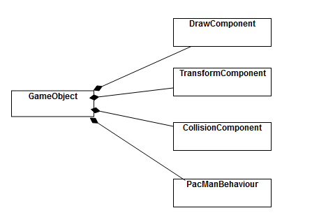
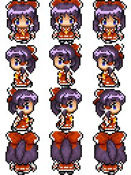
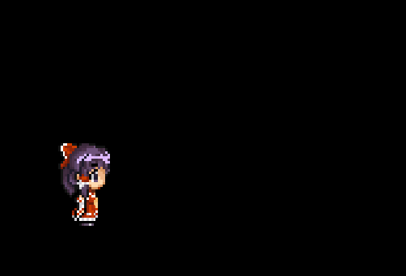
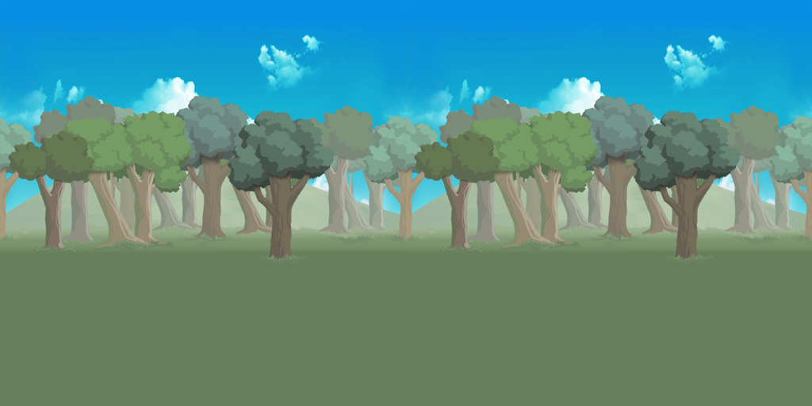

# 第二章 游戏对象和 2D 图形

## 前言

&emsp;&emsp;这一章中，我们要设计比上一章的 Phong 中更加通用的游戏模型以使得我们能够更加灵活的编程。同时，也会熟悉如何使用 SDL 库来制作精灵动画，这一章做的游戏会很简单，基本上只有效果的实现。下一章的项目将会在这一章项目的基础上进行添加。同时这一章也会搭建我们整个引擎的基本架构的一部分。

## 2.1 游戏对象

&emsp;&emsp;在第一章中，两个乒乓球拍之间有着共同的特性，如果考虑多个乒乓球的话，他们之间也有共同的特性。同时它们都有使用到速度和位置的描述，因此，与其像第一章直接把乒乓球和乒乓球拍写死，不如让它们成为**游戏对象(game object)**。游戏对象是指在游戏世界中进行更新，产生输出或者两者都有的各种事物。游戏对象可以有多种实现方式，可以采用对象层次结构，也可以采用组成结构。无论如何，它们要完成的任务都是一样的。

### 2.1.1 游戏对象的类型

&emsp;&emsp;最常见的游戏对象是在游戏循环**更新游戏世界**的阶段进行每一帧的更新，在**生成输出阶段**进行每一帧的绘制。
&emsp;&emsp;有时，开发人员会称游戏中不会更新的对象称为**静态对象**，比如 Phong 中的墙壁。会动的称为动态对象，比如各种游戏中的角色与怪兽。
&emsp;&emsp;相机(camera)是一种会进行更新，但是不会被绘制的一种游戏对象。而很多游戏中的天空盒(sky box)，则是只会被绘制，不会更新的游戏对象。

### 2.1.2 游戏对象模型

&emsp;&emsp;有很多游戏对象模型，它们或多或少都有些独特的优缺点，我们自研引擎的时候，应当进行相应的权衡。

&emsp;&emsp;为了讲解一些常用游戏对象模型，我们采用吃豆人的例子进行讲解。

<div align = "center" >

<h4>吃豆人</h4>
</div>

#### 作为类层次结构的游戏对象

&emsp;&emsp;这种模式的思想是：在标准面向对象的层次结构中，声明游戏对象。用于所有使用的游戏对象都继承自一个基本类，因此有时候这种面向对象类层次结构也被成为**单一整体**层次结构。

&emsp;&emsp;要使用这一种模型，首先需要一个基本的类:

```c++
class Actor
{
    // called every frame to update Actor
    virtual void Update(float deltaTime);
    // called every frame to draw the actor
    virtual void Draw();
}
```

&emsp;&emsp;然后，在这个基本类上根据不同的角色我们实现不同的子类。

```c++
class PacMan : public Actor{
    public:
        void Update(float deltaTime) override;
        void Draw() override;
}
```

&emsp;&emsp;我们暂时不考虑鬼之间的差异具体有多少，我们将吃豆人中的每个鬼视作一个类,于是吃豆人的层次结构可以如下描述。

<div align = "center" >

<h4>吃豆人层次结构</h4>
</div>

&emsp;&emsp;这个方法能够一层一层拓宽游戏对象的功能，但是这样也会导致我们加入很多不必要的功能。比如一个固定视角的游戏，我们不需要对墙相关的游戏对象进行更新只需要绘制；不需要对触发器(trigger)进行绘制，但是只需要刷新。

&emsp;&emsp;当我们使用这种游戏对象模型的时候，请尽可能避免出现**钻石型继承**。

#### 具有组件的游戏对象

&emsp;&emsp;许多游戏都使用**基于组件**的游戏对象模型来取代单一的整体式层次结构。Unity 引擎是采用这种思路的一个典型。在这个模型中，游戏对象类是一个组件的容器，组件负责完成各种功能，而容器负责组织组件。

&emsp;&emsp;在这种模式下，我们可以将 PacMan 理解为包含 TransformComponent, CollisionComponent, RendererComponent 和 PacManBehavior 这些组件的一个 GameObject 对象。

<div align = "center" >

<h4>吃豆人组件结构</h4>
</div>

&emsp;&emsp;对于纯粹的组件结构，GameObject 只提供添加与删除组件的方法与相关数据结构，不会提供任何其它功能。

```c++
class GameObject{
    public:
        AddComponent(Component*);
        RemoveComponent(Component*);
    private:
        std::unorder_set<Component*> mComponents;
}
```

&emsp;&emsp;基于组件的游戏对象模型可以更容易地将功能只添加到需要它的特定游戏对象中,而不会添加不需要的功能。比如只有需要被绘制的对象才会添加 RendererComponent 组件。

&emsp;&emsp;但是这个模式的缺点也很明显，当我们绘制场景中的物品时，我们往往需要获取 Transform 的信息，这意味着 RendererComponent 的实现必须要通过 GameObject 查询获取 Transform。根据查询方式的不同，查询操作可能成为性能瓶颈。

#### 具有组件层次结构的游戏对象

&emsp;&emsp;在实际应用中，往往上述两种模式结合使用。我们将一些额外必要的内容放入 GameObject 中，然后提供管理各种组件的容器。在本章，类的声明如下:

```c++
#include<vector>
using namespace std;
	class GameObject
	{
	public:

		// track state of gameobject
		enum State{
			EActive,
			EPause,
			EDead
		};

		// constructor and destructor
		GameObject(class Game* game);
		virtual ~GameObject();

		// add and remove gameobject
		void AddComponent(class Behaviour* behaviour);
		void RemoveComponent(class Behaviour* behaviour);

		//Getters/Setters
		//...
		//call when the object add to the world
		void Awake();
		//update method called from game
		void Update(float deltaTime);
		//update all components attached to the game object
		void UpdateComponents(float deltaTime);
        //any specific update code
		virtual void UpdateGameObject(float deltaTime);

	protected:
		// gameObject's state
		State mState;
		// transform informations
		class Transform* mtransform;
		// components container
		vector<class Behaviour*> mComponents;
		class Game* game;
	};


```

&emsp;&emsp;GameObject 类会有多种状态，包括活跃、暂停以及死亡，在上述代码分别对应"EActive,EPause,EDead"。我们只更新参与 EActive 状态的对象，处于 EPause 状态的对象将会在不被进行任何更新(包括绘制)，对于 EDead 状态的对象会通知游戏将它删除。

&emsp;&emsp;Update 方法首先会调用 UpdateComponents 方法对所有活动组件进行遍历更新，然后调用 UpdateGameObject 函数。为了使得 GameObject 的子类能够自定义行为，因此提供了 UpdateGameObject 方法让子类自定义更新行为。但是对于 GameObject 的对象，这个实现为空。同时为了方便起见，我们定义一个叫 Awake 的方法用于在游戏对象被加入到世界时进行调用。

&emsp;&emsp;在游戏过程中，GameObject 对象会不可避免地用到 Game 对象中的各种内容，比如使用 deltaTime，创建新的游戏对象等。一个解决方案是使用**单例模式**，将 Game 对象变成一个单例。但是我们需要考虑游戏中的游戏的情况，因此我们可能不止一个 Game 类。所以我们不使用单例模式，而是使用一种叫**依赖注入**的方法，让 GameObject 的构造需要用到 Game 对象的指针。

&emsp;&emsp;我们将游戏对象的位置信息封装到了 Transform 类，这个类记录了游戏对象的位置，旋转，缩放等内容。现在只以最简单的方式将其进行实现,会在之后的章节中陆续更新完善。

```c++
class Transform
{
	public:
		Vector2 scale;
		Vector2 position;
		float rotation;
};
```

&emsp;&emsp;接下来我们进行组件类(Behaviour)的声明。在这个类中，我们声明了一个很重要的变量，mUpdateOrder。这个会决定在 GameObject 中，对 Component 进行更新的顺序。比如我们往往希望在别的的内容完成了更新后，再进行绘制；在游戏对象移动后再启用相机。

```c++
class Behaviour
{
public:
	// constructor and destructor
	Behaviour(class GameObject* gameObject, int updateOrder = 100);
	virtual ~Behaviour();
	int GetUpdateOrder() const;
private:
	int mUpdateOrder;
	class GameObject* gameObject;
};
```

&emsp;&emsp;这种混合模型可以避免单一整体对象模型中过于深层次的结构，其层次性也比纯组件模型让其有了更大的拓展空间。虽然不能完全消除组件间的通讯问题，但是我们能够尽可能进行避免。

&emsp;&emsp;目前为止，我们并没有让 GameObject 或者 Behaviour 进行输入的处理。这一章节暂时不考虑这个问题，使用特殊的方式进行处理。在第三章将会重新讨论如何将输入合并到游戏对象模型中。

### 2.1.3 将游戏对象加入循环

&emsp;&emsp;在游戏循环中，我们创建的 GameObject 对象，在完成创建后不能马上加入游戏循环，因为这个过程可能发生在游戏循环的任何位置从而导致一些不确定的行为。同理，我们也不应该直接将不需要的 GameObject 立即删除。因此，在 Game 类中，我们需要特定的容器对 GameObject 的创建与销毁进行管理。

&emsp;&emsp;在这里我们创建三个向量容器，分别用于管理挂起，活跃，死亡状态的 GameObject。游戏更新只遍历更新在 activeList 中的 GameObject。在创建游戏对象后，新加入的游戏对象会加入 pendingList 中，在完成了对 activeList 的操作后，才将 pendingList 中的对象加入 activeList(加入后从 pendingList 中删除以防重复添加)。而在每一次更新的最后，逐个销毁 deadList 中的 GameObject 对象。

```c++
using namespace std;
struct WindowSize {
	int w, h;
};
class Game
{
public:
	Game();
	// initialize a game
	bool Initialize();
	// runs game loop until game is over
	void GameLoop();
	void Shutdown();
	// create new GameObject
	void CreateGameObject(string name = "GameObject");
	// remove GameObject
	void RemoveGameObject(class GameObject*);

private:
	void ProcessInput();
	void UpdateGame();
	void GenerateOutput();

	// game should continue running
	bool mIsRunning;
	// we use this render draw the graphics
	SDL_Renderer* mRenderer;
	// window created by SDL
	SDL_Window* mWindow;
	// record our client window size
	WindowSize mWindowSize;
	// record time count since last frame
	Uint32 mTicksCounts;

	vector<class GameObject*> activeList;
	vector<class GameObject*> pendingList;
	vector<class GameObject*> deadList;
};

```

&emsp;&emsp;Game 其他大体上的内容见上一章节，在这一章节中我们需要着重对 GameLoop 中的 UpdateGame 和 GenerateOutput 进行修改，GenerateOutput 稍后会提到。

```c++
void Game::UpdateGame() {

	// Calculate delta time
	Uint32 expectCounts = mTicksCounts + 16;
	while (SDL_GetTicks() < expectCounts);// wait until 16 ms pass
	float deltaTime = (SDL_GetTicks() - mTicksCounts) / 1000.0f; //it stores counts of ms
	mTicksCounts = SDL_GetTicks();
	deltaTime = min(deltaTime, 0.5f);

	for (auto it = activeList.begin(); it != activeList.end(); it++) {
		(* it)->Update(deltaTime);
	}

	for (auto it = pendingList.begin(); it != pendingList.end(); it++) {
		activeList.emplace_back(*it);
		(*it)->Awake();
	}
	pendingList.clear();

	for (auto it = deadList.begin(); it != deadList.end(); it++) {
		delete (*it);
	}
	deadList.clear();
}
```

## 2.2 精灵(Sprite)

&emsp;&emsp;精灵(sprite)是 2D 游戏中的可视对象，通常用于表示角色、背景以及其他动态 2D 对象。每个精灵都有一个或者多个与之相关的图像文件这些图像往往有着不同的格式。PNG 格式的文件占用的空间少，但是因为硬件本身不能直接支持 PNG 图像，因此处理起来会花费较多的时间。很多游戏会根据平台的不同选择不同的图片文件格式，比如 IOS 系统推荐使用 PVR， PC 和 XBox 推荐使用 DXT。在这个项目中，我们选择使用 PNG 文件，因为现在图像编程程序普遍支持 PNG 类型文件，而不用专研具体平台。

### 2.2.1 加载图像文件

&emsp;&emsp;要使用 2D 精灵图像，一个很重要的事情就是初始化对 2D 图像的支持，第一步，我们需要使用 IMG_Init 函数初始化 SDL 图像，IMG_Init 和上一章节提到的窗口和渲染器选项一样，使用标志位进行初始化，并且支持位运算进行初始化。注意，该函数在**SDL_Image.h**头文件中，请务必配置好。我们目前只考虑 PNG，因此在 Game::Initialize()中加入` IMG_Init(IMG_INIT_PNG);`

&emsp;&emsp;当然，我们需要在加载图像后才能对图像进行操作。为了使得编码方便，我们在 Game 类的申明中加入 Game::LoadData 函数，目前在这个函数我们使用硬编码，在后面的章节我们会将它进行解耦。

```c++
class Game
{
public:
	Game();
	// initialize a game
	bool Initialize();
	// load data from file
	bool LoadData();
	...
}
```

&emsp;&emsp;加载图片需要使用到 IMG_Load 函数，其函数声明如下。我们输入我们要加载图片的文件名，然后 SDL 会帮我们加载对应的图片，然后返回一个 SDL_Surface 的指针。如果加载失败，将会返回 nullptr

```c++
SDL_Surface * IMG_Load(const char *file);
```

&emsp;&emsp;当我们需要绘制的使用，我们需要调用 SDL_CreateTextureFromSurface 函数来从 SDL_Surface 中创建 SDL_Texture，SDL_Texture 才是参与绘制的内容。函数声明如下。其将会返回一个 SLD_Texture 的指针。

```c++
SDL_Texture * SDL_CreateTextureFromSurface(SDL_Renderer * renderer, SDL_Surface * surface);
```

&emsp;&emsp;为了方便，我们创建一个将这两步合成为一个函数。

```c++
SDL_Texture* LoadTexture(const char url[],  SDL_Renderer  *mRenderer) {
	SDL_Surface*  surface= IMG_Load(url);
	if (surface == nullptr) {
		SDL_Log("Failed to load texture from file %s",url);
		return nullptr;
	}

	SDL_Texture* texture = SDL_CreateTextureFromSurface(mRenderer,surface);
	if (texture == nullptr) {
		SDL_Log("Failed to convert texture from file %s", url);
		return nullptr;
	}
	return texture;
}
```

&emsp;&emsp;在实际开发过程中，我们应该注意到一个问题，我们并不需要多次从磁盘中加载同样的资源到内存中，这既浪费资源又没有意义。因此实际开发中我们需要一个强大的资产管理系统来管理所有类型的资产。但是这并不是这一章节的内容，因此我们这一章节使用简单的哈希映射'unorder_map'来解决这个问题。

```c++
unordered_map<string , SDL_Texture* > textureAssets;
```

&emsp;&emsp;为了使 GameObject 能更加自由创建 texture，因此我们可以在 Game 中提供 Game::GetTexture()函数

```c++
SDL_Texture* Game::GetTexture(string texUrl) {
	if (textureAssets[texUrl] != nullptr) {
		return textureAssets[texUrl];
	}
	else {
		SDL_Texture* res = LoadTexture(texUrl.data(), mRenderer);
		textureAssets.insert({texUrl, res});
		return res;
	}
}
```

### 2.2.2 绘制精灵

&emsp;&emsp;假设我们游戏是有个拥有背景与角色的游戏。绘制该场景比较简单的算法是**画家算法**。画家算法是一种很基础简单的算法，其思路是从后往前地进行绘制，这样可以将物体按照深度进行覆盖。但是缺点在于这种算法无法准确定义覆盖关系，即很难将其用于绘制 3D 场景。
&emsp;&emsp;画家算法虽然不是非常通用的算法，不过其简单，画家算法在 2D 游戏中是非常好用的。

<div align = "center" >

<h4>画家算法</h4>
</div>

&emsp;&emsp;上面的这幅图是画家算法的一个例子，为了画出这样一个山的场景，我们先将山和天空作为背景进行绘制，然后再绘制离观察者更近的草地，最后再草地上画出离观察者更近的树。

&emsp;&emsp;因为我们采用了组件的游戏模型，所以我们没必要把绘制的功能写死，而是通过使用相应的组件完成。因此，我们现在创建一个 Sprite 类，类声明如下：

```c++
class Sprite :
    public Behaviour
{
public:
    Sprite(GameObject* owner, int drawOrder = 100);
    ~Sprite();

    virtual void Draw(SDL_Renderer*);
    virtual void SetTexture(SDL_Texture*);

    int GetDrawOrder() const { return mDrawOrder; };
    int GetTextureHeight() const { return mTexHeight; };
    int GetTextureWidtht() const { return mTextWidth; };

protected:
    // texture to draw
    SDL_Texture* mTexture;
    // draw order used for painter's algorithm
    int mDrawOrder;
    // Width/Height of texture
    int mTextWidth;
    int mTexHeight;
};

```

&emsp;&emsp;绘制的顺序是由 mDrawOrder 属性决定的，请注意**Order 越大，绘制顺序越靠后，越不会被覆盖**。

&emsp;&emsp;因为 Game 的 SDL_Renderer\* 不应该直接对外开放，因此我们需要在 Game 中提供相关添加 Sprite 的功能。

```c++
void Game::AddSprite(Sprite* sprite) {
	int order =  sprite->GetDrawOrder();
	auto iter = mSpriteList.begin();
	for (; iter != mSpriteList.end(); ++iter) {
		if (order < (*iter)->GetDrawOrder()) break;
	}
	mSpriteList.insert(iter,sprite);
}
```

&emsp;&emsp;这段代码在添加 Sprite 的同时，也注意保持了相关的绘制顺序，所以我们可以在 GenerateOutput 的阶段遍历 Sprite 的容器，并且在**活跃的**Sprite 组件上调用 Draw 方法。

&emsp;&emsp;现在把目光拉回 Sprite，SetTexture 方法不仅可以设置 Texture，我们也可以通过获得的纹理一次性将 mTexWidth 和 mTexHeight 设置好。

&emsp;&emsp;SDL_QueryTexture 中我们传入的第一个参数是要查询的纹理信息，第二个参数用于查询像素传输时使用的原始格式，第三个参数是用于访问纹理的指针，第四五个分别是宽带和高度。我们在这里只需要宽度和高度。

```c++
void Sprite::SetTexture(SDL_Texture* tex) {
	mTexture = tex;
	SDL_QueryTexture(tex, nullptr, nullptr, &mTexWidth, &mTexHeight);
}
```

&emsp;&emsp;SDL 库提供了两种不同的纹理绘制函数，相对简单的函数为 SDL_RenderCopy 函数，若能成功绘制返回 0，否则返回 1。

```c++
int SDL_RenderCopy(SDL_Renderer * renderer,
                    SDL_Texture * texture,
                    const SDL_Rect * srcrect,// part of texture to draw (draw whole if null)
                    const SDL_Rect * dstrect);// rectangle to draw onto the target
```

&emsp;&emsp;SDL_RenderCopyEx 则支持更加高级的绘制行为，比如旋转。

```c++
extern int SDL_RenderCopyEx(SDL_Renderer * renderer,
                            SDL_Texture * texture,
                            const SDL_Rect * srcrect,
                            const SDL_Rect * dstrect,
                            const double angle,//rotation angle in clockwise degree
                            const SDL_Point *center,//point to rotate about (null for center)
                            const SDL_RendererFlip flip); // how to flip texture (usually SDL_FILE_NONE)
```

&emsp;&emsp;虽然 SDL_RenderCopy 更加方便，但是 SDL_RenderCopyEx 更加通用，不过其给我们在对 Sprite::Draw 的编码增加了一点复杂度，我们应该注意以下问题：

1. SDL_Rect 定义的坐标是目标左上角的坐标，但是需要旋转的话我们得在中心点定义旋转。
2. SDL_RenderCopyEx 的旋转角是按**度数**，而我们的 Transform 使用的是**弧度**。同时，因为旋转方向是顺时针方向，因此我们应该对旋转角度取反。

```c++
void Sprite::Draw(SDL_Renderer* renderer) {

	if (!mTexture || !mgameObject->IsActive()) return;
	SDL_Rect r;

	Vector2 scale = mgameObject->GetTransform()->scale;

	r.w = (int)(scale.x*mTexWidth);
	r.h = (int)(scale.y * mTexHeight);

	Vector2 pos = mgameObject->GetTransform()->position;
	r.x = (int)(pos.x - r.w /2);
	r.y = (int)(pos.y - r.h / 2);

	float rotation = mgameObject->GetTransform()->rotation;
	SDL_RenderCopyEx(renderer,
		mTexture,
		nullptr,//null to draw whole texture
		&r,// where to draw
		-(rotation/M_PI)*180.0, // convert radius to clockwise angle
		nullptr,//point of rotation, null for texture centure
		SDL_FLIP_NONE);// no filp
}
```

&emsp;&emsp;目前，这样的 Draw 方法只能适用于固定区域的绘制，如果需要更大的地图的话，我们需要使用到相机(camera)，相机将会在第九章提到。

### 2.2.3 精灵动画

&emsp;&emsp;大多数 2D 游戏对象都使用类似翻页动画的技术实现精灵动画。翻页动画指的是通过一系列连续快速播放的静态 2D 图像，来创建一种动画的感觉。随着帧率的变化，精灵动画会给玩家不同的体验，形成类似加速减速等视觉效果。大多数游戏都使用 24FPS 的精灵动画，这就表示动画每一秒都需要 24 张独立的图像。对于 2D 格斗游戏的话，需要的帧率可能更高，但是实际上大多数精灵动画都不会执行到一秒。

<div align = "center" >

<h4>精灵动画(图源爱给网:<href>https://www.aigei.com/view/73082.html#items</href>)</h4>
</div>

&emsp;&emsp;表示精灵动画最简单的方式是使用容器，我们将我们要使用的每一帧的动画存放在容器中。我们现在声明一个 AnimSprite 类来进行处理，我们仍然使用灵梦作为我们这次项目的主角，但是只用第三排。

&emsp;&emsp;我们使用一个继承自 Sprite 的类来定义精灵动画。

```c++
class AnimSprite :
    public Sprite
{
public:
    AnimSprite(class GameObject* owner, int drawOrder = 100);

    // we need to update sprite every frame
    void Update(float deltaTime) override;
    // void Draw
    void Draw(SDL_Renderer*) override;

    // get/set FPS
    float GetAnimFPS() const { return mFPS; };
    void SetAnimFPS(float fps) { mFPS = fps; };
	...
private:
	...
    //current FPS
    float mFPS;
    // frame now displayed
    float mCurrentFrame;
	// current displayed Sprite Slice
    int mRectIdx = 0;
};

```

&emsp;&emsp;先看私有变量。在这个类中，我们定义了 mFPS, mCurrentFrame，mRectIdx 这三个变量，mFPS 是我们定义的动画帧率，而 mCurrentFrame 用于定义当前运行的帧数，我们将使用这两个变量来控制动画的切换。而 mRectIdx 则用来表示该绘制哪个图像。并且，我们重写了 Update 和 Draw 方法用于专门的绘制。

&emsp;&emsp;书上的内容是直接使用多张连续的图像来进行动画切换，但是因为我相信大部分同学在网上找到的资源都是单张 png 的精灵图集。因此我这里采用了一些别的数据结构而没完全按照书上走。

```c++
struct SpriteSlice
{
    SDL_Rect srcret;
    float totalFrames;
};
class AnimSprite :
    public Sprite
{
public:
    ...
    void SetAnimTextures(const std::vector<SpriteSlice> *textures) { mAnimTextures = *textures; };
    bool mRepeat = true;

private:
	...
    //sprite animation informations
    std::vector<SpriteSlice> mAnimTextures;
    // current displayed Sprite Slice
    int mRectIdx = 0;
};
```

&emsp;&emsp;前文提到过 SLD_CopyEx 这个绘制函数，其接受一个叫 srcrect 的 SDL_Rect 对象指针作为参数，用于定义绘制区域。因此我定义了 SpriteSlice 这个结构体，其由绘制具体区域要用到的 SDL_Rect 对象与一个叫 totalFrames 的浮点数组成。前者决定绘制区域，后者决定该区域的精灵动画的持续帧数。`std::vector<SpriteSlice> mAnimTextures;`则是具体装 SpriteSlice 的容器了，mRectIdx 也指向其中的值。

&emsp;&emsp;根据软件工程的要求，我们应该只让 Draw 定义如何绘制，而让 Update 函数定义动画与时间相关的行为。因此，我们应该在这里更新具体的帧率与具体指向的 SpriteSlice。

```c++
void AnimSprite::Update(float deltaTime)  {
	if (mAnimTextures.size() < 1) return;

	int size = mAnimTextures.size();
	// calculate frame counts from last sprite
	mCurrentFrame += mFPS*deltaTime;
	// when slice's time is over, swap sprite and reset mCurrentFrame
	if (mCurrentFrame > mAnimTextures[mRectIdx].totalFrames) {
		mCurrentFrame =0.f;
		++mRectIdx;
		if (mRepeat)mRectIdx %= size;
		else mRectIdx = min(mRectIdx, size - 1);
	}
}
```

&emsp;&emsp;Draw 函数与之前的区别不大，只是我们需要指定绘制的区域。

```c++
void AnimSprite::Draw(SDL_Renderer* renderer) {
	// if it got texture and the owner is active, it will draw
	if (!mTexture || !mgameObject->IsActive()) return;

	SDL_Rect r;

	Vector2 scale = mgameObject->GetTransform()->scale;
	//set sprite scale draw on the screen
	r.w = (int)(scale.x * mTexWidth * mSpriteScale.x);
	r.h = (int)(scale.y * mTexHeight * mSpriteScale.y);
	// set where sprite draw on the screen
	Vector2 pos = mgameObject->GetTransform()->position;
	r.x = (int)(pos.x - r.w /2);
	r.y = (int)(pos.y - r.h / 2);

	SDL_Rect* rec = mAnimTextures.size() < 1? nullptr: &mAnimTextures[mRectIdx].srcret;
	float rotation = mgameObject->GetTransform()->rotation;
	SDL_RenderCopyEx(renderer,
		mTexture,
		rec,//null to draw whole texture
		&r,// where to draw
		-(rotation/M_PI)*180.0, // convert radius to clockwise angle
		nullptr,//point of rotation, null for texture centure
		SDL_FLIP_NONE);// no filp
}
```

&emsp;&emsp;因为不像 Unity 那样直接可以通过可视化拖拽添加组件，我们将我们需要加入的游戏对象专门用一个类定义会比用 main 函数一个个加干净地多。

```c++
class Character :
    public GameObject
{
public:
    Character(class  Game*, string name = "Character");
    void Awake() override;

private:
   vector<SpriteSlice> mSlices;
};

Character::Character(Game *owner, string name):GameObject(owner,name) {

	SpriteSlice first{ {0,128,52,64},6.f };
	SpriteSlice sec{ {64,128,52,64},6.f };
	SpriteSlice thi{ {128,128,52,64},6.f };
	SpriteSlice sec2{ {64,128,52,64},6.f };

	mSlices.push_back(first);
	mSlices.push_back(sec);
	mSlices.push_back(thi);
	mSlices.push_back(sec2);

	mTransform->SetPosition(260, 160);
	mTransform->SetScale(1.f, 1.f);

}

void Character::Awake() {
	mTransform->SetPosition(100.f, 230.f);
	AnimSprite* character = new AnimSprite(this);
	AddComponent(character);
	character->SetTexture(GetOwner()->GetTexture(string("../Chapter2/Sprite.png")));
	character->SetSpriteScale(Vector2{ 0.4f,0.4f });
	character->SetAnimTextures(&mSlices);
}
```

&emsp;&emsp;现在 main 写成这样：

```c++
	Game* game = new  Game();
	game->Initialize();
	game->AddGameObject(new Character(game));
	game->GameLoop();
```

&emsp;&emsp;点击运行可看效果啦。**注意，加载图像的时候请正确描述路径。**

<div align = "center" >

<h4>效果图</h4>
</div>

&emsp;&emsp;现在我们不适用 Game 直接处理输入，而是直接在这个 UpdateGameObject 函数中进行输入读取并且进行跳跃。目前我们用不实现太真实的物理效果。

```c++
void Character::UpdateGameObject(float deltaTime) {
	Vector2 pos = mTransform->position;
	pos.y -= speed;
	mTransform->SetPosition(pos.x, pos.y);
	if (pos.y < ground) {
		speed -= 9.8f * deltaTime;
	}
	else {
		speed = 0.f;
		pos.y = ground;
	}

	const Uint8* state = SDL_GetKeyboardState(NULL);

	if (pos.y >= ground && state[SDL_SCANCODE_SPACE]) {
		speed = 5.f;
		SDL_Log("space");

```

&emsp;&emsp;现在按空格键可以起跳了。

<div align = "center" >

</div>

## 2.3 滚动背景

&emsp;&emsp;2D 游戏中，一个常用的技巧是添加一个滚动的无限循环的背景，这会给玩家一种大世界的感官效果，这个在跑酷游戏中很常见。角色实际上并不会移动，但是会给玩家一种正在不断跑动的错觉。一个比较简单的实现是将背景分割为屏幕大小的图像部分，这些图像部分会在每帧重新定位，以造成滚动错觉。

<div align = "center" >

</div>

&emsp;&emsp;但是因为我没有办法提供那样的分解的图，于是采用另外一种常用的方法，即将一张能在构图上收尾相连的图拼接在一起。然后通过修改目标绘制区域来构成循环背景的效果。即当背景移动到中心位置后，把目标绘制区域移动到出发点。因为构图上能够首位相连，所以直接移将绘制区域移动到原点的时候玩家不会感觉到不自然。因此这样就能给玩家一种循环背景的感觉。

<div align = "center" >

<h4>构图上首位相连的背景图</h4>
</div>

&emsp;&emsp;为了实现这个功能，我们为背景创建一个基础自 Sprite 类的 RollingBG 类。其声明如下。

```c++
class RollingBG :
    public Sprite
{
public:
    enum RollingDir{
        Up = 0, Down = 1, Left = 2, Right = 3
    };

    RollingBG(class  GameObject* owner, int drawOrder = 10);
    void Update(float) override;
    void Draw(SDL_Renderer*) override;

    // the area of background draw on the screen
    void SetRollingArea(int x, int y, int w, int h) {
        mOrigin = { x,y,w,h };
        mRect = mOrigin;
        mRollingDistance = mOrigin.x;
    };

    // set the direction we roll the background
    void SetRollingDir(RollingDir dir = Right) { mDir = dir; }
    void SetRollingSpeed(float speed) { mRollingSpeed = speed; }

private:
    // the area of background first draw on the screen
    SDL_Rect mOrigin{ 0,0,0,0 };
    // the real rect we draw on the screen
    SDL_Rect mRect;
    // direction of rolling
    RollingDir mDir = Right;
    float mRollingSpeed = 0.f;
    //record how far background rolling
    float mRollingDistance = 0.f;
};
```

&emsp;&emsp;我们在这个类中，定义了一个叫 RollingDir 的枚举类型来定义背景的滚动方向，默认向右滚动，毕竟这样比较符合我们的实际需要。然后我们定义了两个 SDL_Rect 结构体，分别叫做 mOrigin 和 mRect，mOrigin 记录的是初始的绘制区域，而 mRect 是我们传给 SDL_Renderer 的绘制区域。接下来是 Update 的定义。

```c++
void RollingBG::Update(float deltaTime) {
	mRollingDistance += mRollingSpeed * deltaTime;

	// means horizontal movement
	if (mDir > 1) {
		// moved to the mid, go back to origin
		if ( mRollingDistance >= mTexWidth / 2) {
			mRollingDistance = 0;
		}
		// calculate srcrect and avoid out of pic boundry
		mRect.x = static_cast<int>(mDir == Right? mRollingDistance : mTexWidth/2-mRollingDistance);
	}
	else {
		if ( mRollingDistance >= mTexHeight / 2) {
			mRollingDistance = 0;
		}
		mRect.y = static_cast<int>(mDir == Down ? mRollingDistance : mTexHeight / 2 - mRollingDistance);
	}
}
```

&emsp;&emsp;在 Update 中，我们需要完成更新 srcrect 区域的任务。我们根据我们定义的方向对图像进行滚动，当滚动的距离有图片宽度(或者长度，取决于是水平还是竖直方向滚动)一半时，将 srcrect 设置成原点。因此，我们需要用到 mTexWidth 和 mTexHeight 的帮助。

&emsp;&emsp;Draw 没什么好说的。同理，为了方便，我们定义一个叫 BackgroundObj 的类来绘制背景。其没有别的函数声明，只是实现了自己的 Awake 函数。

```c++
void BackgroundObj::Awake() {
	RollingBG* bg = new RollingBG(this);
	bg->SetTexture(mOwner->GetTexture("../Chapter2/forestRepeat.png"));
	bg->SetRollingArea(0, 0, 512, 512);
	bg->SetRollingSpeed(50.f);
	bg->SetRollingDir(RollingBG::Right);
	AddComponent(bg);
}
```

&emsp;&emsp;效果如图:

<div align = "center" >

<h4>循环背景</h4>
</div>

### 2.3.1 视差背景

&emsp;&emsp;很多游戏利用背景移动速度的差异来形成视差效果，这种效果往往会给玩家比较好的层次感，一个是因为近大远小，还有一个是对于人来说，离得近的东西开起来与你相对移动更快，而离得远的会更慢。

<div align = "center" >

<h4>一个视差背景的例子</h4>
</div>

&emsp;&emsp;按照我们上面的说法，我们在 BackgroundObj 中加入新一层背景来实现视差效果较好。为了方便调整，我稍微做了点修改，但是这些很简单，没必要讲。

```c++
void BackgroundObj::Awake() {
	SetMainBackground();
	SetSecBackground();
}

void BackgroundObj::SetMainBackground() {
	RollingBG* bg = new RollingBG(this);
	bg->SetTexture(mOwner->GetTexture("../Chapter2/forestRepeat.png"));
	bg->SetRollingArea(0, 0, 512, 512);
	bg->SetRollingSpeed(30.f);
	bg->SetRollingDir(RollingBG::Right);
	bg->SetSpriteScale(Vector2{ 1.0f, 1.8f });
	bg->SetSpriteOffset(Vector2{ 0.f, 140.f });
	AddComponent(bg);
}

void BackgroundObj::SetSecBackground() {
	RollingBG* bg = new RollingBG(this, 11);
	bg->SetTexture(mOwner->GetTexture("../Chapter2/bg2.png"));
	bg->SetRollingArea(0, 0, 512, 512);
	bg->SetRollingSpeed(50.f);
	bg->SetRollingDir(RollingBG::Right);
	bg->SetSpriteScale(Vector2{ 1.0f, 1.0f });
	bg->SetSpriteOffset(Vector2{ 0.f, 250.f });
	AddComponent(bg);
}
```

&emsp;&emsp;现在来看看效果：

<div align = "center" >

</div>

## 总结

&emsp;&emsp;这一章中，我们主要学习了现在比较主流的游戏引擎模型，即作为类层次结构的游戏对象，与具有组件层次结构的游戏对象，以及两种结构的混合方式。接下来则是学习了如何使用 SDL 库绘制 png 图像，然后我们根据 png 图像来制作我们的精灵动画。同时也学习了画家算法以正确定义该如何对 2D 图像的顺序进行正确绘制。接下来则是学习循环背景到视差背景的绘制。

&emsp;&emsp;本章的项目目前看来只是个走路模拟器，虽然我们可以像《phong》那样强行给我们的游戏添加一些障碍，但是下一章会讲解更加常用的碰撞物理算法。因此这一章节的项目不进行实现（主要是我肝不动了）。

## 练习题

1. 思考有个动物狩猎游戏，在这个游戏中，玩家可以驾驶不同的车在野外狩猎动物。对于游戏中不同的车，动物，植物。请尽可能设计一种比较通用合理的结构来展示你的游戏世界。

2. 图块集(tile set)包含一系列固定大小的图块，常常用于设计 2D 地图。Tiled 程序则是一个用于生成图块集并且进行图块映射的优秀程序，请学习 Tiled 程序生成自己的一个地图。
