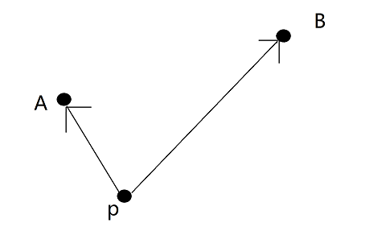
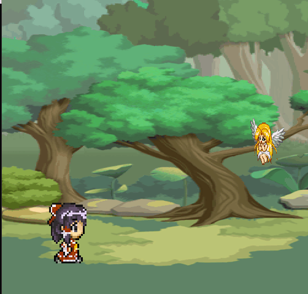
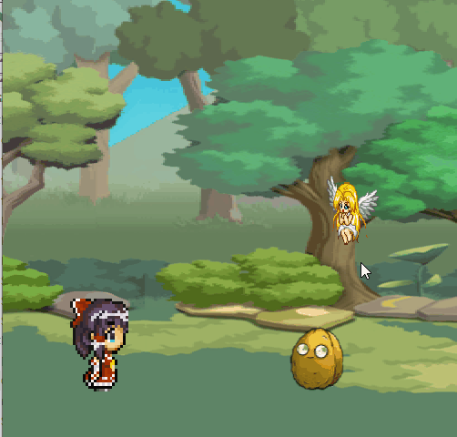

# 第三章 向量和基础物理

## 前言

&emsp;&emsp;**向量**是游戏程序员会一直用到的最基本数学根据，本章内容将会讨论向量的基本概念及运算，然后讨论这些运算在游戏开发中的意义。在这一章中，我们将完善一个专门用来进行输入的组件，而不是像上一章节直接强行定义。同时在这一章中，我们将会学习简单的 Eigen 数学库操作，Eigen 库是一个很强大的线性代数的数学库。在后面的章节，我们会使用 Eigen 库进行更加复杂的矩阵计算。

&emsp;&emsp;此外，一个坏消息，因为 Eigen 库的引入，Transform 类必须改名字，然后之前我们定义的 Vector 结构体就不用了。好消息是现在代码写的不多，可以比较快的直接修改。

&emsp;&emsp;这一章前面的内容很基础，有线性代数基础并且了解牛顿力学基础的话快速浏览，然后了解下 Eigen 库操作即可。

&emsp;&emsp;还有，我不是这些游戏的厨，我之所以使用它们只是因为它们适合用于项目功能的展示，请不要用 OC 来道德绑架我，当然这样我也不会理你。

## 1.1 向量

&emsp;&emsp;向量 Vector(为了与 C++ std::vector 区分因此使用大写)表示一个 n 维空间的大小和方向，每个维度对应一个向量。比如二维(2D)向量具有 xy 两个方向的分量。下面是一个 2D 向量 $\vec{V}$ 的写法。
$$ \vec{V} = <V_x,V_y>$$
&emsp;&emsp;向量本身是没有位置的概念，只有方向与大小（长度）。如果向量的大小与方向相同，那么它们的等价的。虽然我们从哪里开始绘制向量都不会改变向量的值，但是我们仍然通常绘制**起点(尾部)**在原点的向量，将它指向空间中的某一特定点。

&emsp;&emsp;当我们使用 Eigen 定义向量的时候，代码如下:

```c++
#include <Eigen/Core>
using namespace Eigen;

int main(int argc, char* argv[]) {
	Vector2f vec2(1, 2);
	Vector3f vec3(1,3,5);
	Vector4f vec4(1, 2, 3, 5);
	return 0;
}
```

&emsp;&emsp;需要说明的是，在实际的游戏中，我们使用双精度浮点数是不必要的，同时还会带来比较大的性能开销，因此我们基本上只会使用浮点型向量，即上面的`VectorXf`的形式。当使用这个库的时候，我们需要引入头文件<Eigen/Core>。为了方便起见，我引入了 Eigen 的命名空间，如果不引入的话，则需要写成。

```c++
	Eigen::Vector2f vec2(1, 2);
	Eigen::Vector3f vec3(1,3,5);
	Eigen::Vector4f vec4(1, 2, 3, 5);
```

&emsp;&emsp;游戏中，通常使用向量描述**对象的方向**。对象的**前向向量(forward base)**表示对象**直线向前**的方向。同时，由于向量没有位置但是有大小和方向，因此很适合用于表示速度，这在稍后会讲到。

&emsp;&emsp;为了方便，我们在本章只写 2D 向量，这些知识拓展到 3D 空间是等价的。

### 3.1.1 向量的减法

&emsp;&emsp;使用向量减法，值上是一个向量的在各个方向的分量分别减去另一个向量在相同对应方向的分量。
$$\vec{c} = \vec{a} - \vec{b} = <a_x-b_x,a_y-b_y>$$
&emsp;&emsp;其几何意义一个当 $\vec{a}$ $\vec{b}$ 尾部相连时从$\vec{a}$的头部指向$\vec{b}$的头部。挑个网图说明一下：

<div align = "center" >

<h4>向量减法</h4>
</div>

&emsp;&emsp;假如有个射击游戏，我们希望从某个固定炮台攻击鼠标指向的位置，我们则可以通过鼠标的位置减去炮台的位置来获取相应坐标。

&emsp;&emsp;Eigen 库为 VectorXf 重载了减法运算符，因此我们可以很方便的进行向量减法运算。

```c++
	Vector3f vec = {0,1,0};
	Vector3f vec2 = {1,1,1};
	cout << vec2 - vec;
```

### 向量缩放：标量乘法除法

&emsp;&emsp;我们可以将向量乘以某个标量（单个值），这相当于该向量的每个分量乘以这个值。
$$s.\vec{a} = <s.a_x,s.a_y>$$
&emsp;&emsp;用标量乘以向量会改变向量的大小，而若向量为负的话还会翻转向量的方向。这个非常适合在很多游戏中，实现速度与方向的分离。这个时候我们只用维持一个方向向量与一个速度标量，通过它们的乘积算出单位时间的移动距离。

&emsp;&emsp;同理，Eigen 也重载了乘法运算符。

```c++
	Vector3f vec = {0,1,0};
	cout << vec*2;
    cout << 2*vec;
```

&emsp;&emsp;此外，向量也有标量除法，相当于对向量的每个分量进行缩放。
$$s.\vec{a} = < \frac{a}{s} , \frac{a}{s}>$$
&emsp;&emsp;注意，**0 不能作为除数(分母 )**。虽然在浮点数运算中，0 作为除数不会直接带来异常，但是这会导致值变为 NAN，我们对 NAN 做的任何操作得到的结果都是 NAN

### 3.1.3 向量的加法

&emsp;&emsp;向量加法，使得我们可以将两个向量各个方向的分量分别相加，得到一个新的向量。
$$\vec{c} = \vec{a}+\vec{b} = <a_x+b_x, a_y + b_y>$$
&emsp;&emsp;我们可以用三角形法则与平行四边形法则描述向量加法。

<div align = "center" >

</div>

&emsp;&emsp;其典型的应用是用于表示位置的改变，可以回顾我们上一章节的移动操作。

&emsp;&emsp;同理，Eigen 也重载了加法运算符。

```c++
	Vector3f vec = {0,1,0};
	cout << vec+vec;
    cout << vec;
```

### 3.1.4 向量长度

&emsp;&emsp;前面提到了向量有方向和大小，而向量的大小，我们常常称为向量的**模长**，理解为长度，通常记作 $||\vec{a}||$ 的形式。其计算公式如下：
$$||\vec{a}||=\sqrt{a_x^{2}+{a_y^{2}}}$$
&emsp;&emsp;在游戏开发中，我们可以通过模长来判断对象之间的距离。假设有一个智能子弹，其会优先攻击距离它最近的目标。如下图，设子弹在点 P，通过计算 A-P 和 B-P 可以得到从 P 指向二者的向量。然后我们可以根据这个向量的模长判断距离大小。

<div align = "center" >

</div>

&emsp;&emsp;但是在实际应用中，计算模长的开方的代价是比较大的，为了简单处理，我们一般使用向量的平方来比较距离。比如在上图中我们会使用 $\vec{a}.\vec{a}$ 与 $\vec{b}.\vec{b}$ 作比较判断距离。

&emsp;&emsp;$\vec{a}.\vec{a}$ 的结果是$\vec{a}$模长的平方，这被称为向量的点积，具体什么是点积等下会讲到。Eigen 上述两个库的表示如下：

```c++
	Vector3f vec = {0,1,0};
	Vector3f vec2 = {1,1,1};
	cout << vec2.norm()<<endl; // 计算模长
	cout << vec2.dot(vec2); // 点乘
```

### 3.1.5 单位向量和标准化

&emsp;&emsp;单位向量是长度为 1 的向量。通常为了特定区分一个向量为单位向量，我们会将其写作 $\hat{a}$ 这样的形式。将一个向量转化为单位向量的过程称为标准化(0 向量不能被标准化)。标准化很简单，即向量除以向量的模长。

$$\hat{a} = <\frac{a_x}{||\vec{a}||},\frac{a_y}{||\vec{a}||}>$$

&emsp;&emsp;一个比较常用的思路是，如果我们只需要方向，那么我们则应当对向量进行标准化。比如**前向向量**。

&emsp;&emsp;Eigen 为我们提供的标准化函数如下:

```c++
    vec2.normalize(); //将原始向量标准化，返回空
    vec2.normalized(); //返回标准化的向量，但是并不会改变原始向量
```

### 3.1.6 计算前向向量

&emsp;&emsp;目前，transform 组件中的 rotation 变量只是一个表示弧度的浮点数类型。对于一个 2D 的 GameObject，我们计算前向向量的方式很简单，我们只需要一个分别将角度的 cos 和 sin 值存储在一个二维向量中就好。我们应该在 GameObject 类中添加这个方法。

### 3.1.7 将向量转化为角度

&emsp;&emsp;角度与向量的计算往往在很多时候是很重要的问题，比如我们习惯性使用向量表示方向，但是上一张的绘制 Sprite 的 API 需要用到角度进行计算旋转。因此我们需要一些方式来进行角度与向量的转换。通常我们会使用 atan2 函数来将向量转化为弧度，从弧度转化为角度是很简单的一件事。

&emsp;&emsp;atan2 函数依次接受对边长度与邻边长度，并且返回一个在[-π,+π]的弧度值。若值为正，则表明向量指向一二象限；为负，则表示指向三四象限。

<div align = "center" >

</div>

&emsp;&emsp;atan2 函数非常适用于 2D 游戏计算角度，3D 游戏通常更适合角度，atan2 函数属于 C++的标准库。

```c++
atan2f(1,1);
```

### 3.1.8 向量点乘

&emsp;&emsp;向量之间的点乘产生单个标量值，点乘最常见的用途之一是找到两个向量之间的角度。点乘的数学表示如下：
$$\vec{a}.\vec{b} = a_x*b_x + a_y*by = ||\vec{a}||||\vec{b}||cos\theta$$
&emsp;&emsp;点乘的 Eigen 写法在**向量长度**提到了写法，这里就不再写一次了。我们可以用两个向量的单位向量来计算两个向量之间角度的余弦值，而通过 acos 函数可以算出具体的弧度。

```c++
cout << acosf(0.5f);
```

&emsp;&emsp;点乘可以让我们算出一个向量在另外一个向量上面的投影。

<div align = "center" >

</div>

### 3.1.8 向量叉乘

&emsp;&emsp;给定两个不共线的向量，叉乘能让我们找出垂直于两个向量所在平面的第三个向量。这在图形学计算中非常常用，在第六章介绍 opengl 的时候我们会直接用到。我们使用$\times$表示两个之间的叉乘运算。
$$\vec{c} = \vec{a}\times\vec{b}$$
&emsp;&emsp;其几何意义如下图：

<div align = "center" >

</div>

&emsp;&emsp;叉乘没有交换律。
$$\vec{c} = \vec{a}\times\vec{b} = - \vec{b}\times\vec{a}$$
&emsp;&emsp;叉乘不适合二维向量，但是要将二维向量转化为一个三维向量，我们只需要将其 z 分量的值置为 0 即可。

&emsp;&emsp;叉乘结果所面向的方向与我们使用的坐标系有关，我们可以通过**左手法则**与**右手法则**，方便判断叉乘在左手系与右手系中结果的朝向，这里就不再展开了。

&emsp;&emsp;叉乘的数值计算规则如下：
$$\vec{c} = \vec{a}\times\vec{b} = <a_yb_z - a_zb_y, a_zb_x - a_xb_y, a_xb_y - a_yb_x>$$
&emsp;&emsp;常用的叉乘助记符为 xyyzzy, 可以尝试使用这个方式记住下标。

&emsp;&emsp;在 Eigen 中，叉乘如下：

```c++
cout << vec2.cross(vec1);
```

&emsp;&emsp;这里有个巨坑，cross 的定义在<Eigen/Geometry>头文件中，因此要使用 cross 的时候别忘了引入这个头文件。具体内容请参考[官方文档 Compilation error with template methods](https://eigen.tuxfamily.org/dox/TopicPitfalls.html)

## 3.2 基本运动与基本输入处理

### 3.2.1 建立一个 BasicMovementComponent 类

&emsp;&emsp;BasicMovementComponent 是一个很简单的类，我们在这里实现简单的对象移动以及旋转，为了方便起见，我们将其类定义如下：

```c++
class BasicMovement :
    public Behaviour
{
public:
    BasicMovement(GameObject* owner, int updateOrder = 10);
    void Update(float) override;

    float AngularSpeed;
    float MovementSpeed;
protected:
    class TransformComponent* mTransform;
};
```

&emsp;&emsp;在这个组件中，我们让对象验证前向向量以一个恒定速率移动。则物体的位移逻辑为：

```c++
position += speed*GetForward()*deltaTime;
```

&emsp;&emsp;我们也可以用类似的逻辑来计算对象的旋转角度。

```c++
rotation += angularSpeed*deltaTime;
```

&emsp;&emsp;因此，BasicMovementComponent 的 Update 方法如下：

```c++
void BasicMovement::Update(float deltaTime) {
	Eigen::Vector2f position = mTransform->position;
	float rotation = mTransform->rotation;

	position += mgameObject->GetForwardBase() * MovementSpeed * deltaTime;
	rotation += AngularSpeed * deltaTime;

	mTransform->position = position;
	mTransform->rotation = rotation;
}
```

&emsp;&emsp;最终效果如下：

<div align = "center" >

</div>

### 3.2.2 建立一个 InputComponent 类

&emsp;&emsp;将输入连接到角色或者组件是一种常见的需求，所以将它合并到游戏对象模型是很明智的选择。换句话说，代码中需要既能够在 GameObject 类也可以在 Behaviour 类中可以重写的函数，这些函数在子类中可以根据需求进行输入的定义。

&emsp;&emsp;所以，我们在 Behaviour 类中定义一个叫 ProcessInput 的函数，其默认实现为空。

```c++
void Behaviour::ProcessInput(const uint8_t* keystate) {
}
```

&emsp;&emsp;然后在 GameObject 类中，声明非虚函数 ProcessInput 和虚函数 ActorInput。ProcessInput 函数用于统一对组件以及自身的输入进行处理，而 ActorInput 对重写的角色行为进行处理。因此，ProcessInput 可以写成这样子。

```c++
void GameObject::ProcessInput(const uint8_t* keystate) {
	if (mState != EActive) return;
	for (auto it = mComponents.begin(); it != mComponents.end(); it++) {
		(*it)->ProcessInput(keystate);
	}
	ActorInput(keystate);
}

```

&emsp;&emsp;为了配合，在 Game 类的 ProcessInput 函数中，我们也需要做相关的修改。

```c++
void Game::ProcessInput() {
	SDL_Event event;// it is a general structure of event
	// SDL_PollEvent assign the event and return true if there is event
	while (SDL_PollEvent(&event)) {
		switch (event.type) {
		case SDL_QUIT:
			mIsRunning = false;
			break;
		}
	}
	//Unit8 is a SDL defined 8 bits unsigned short
	const Uint8* state = SDL_GetKeyboardState(NULL);
	//get input from keyboard
	//...
	if (state[SDL_SCANCODE_ESCAPE]) {//when press escape, stop game
		mIsRunning = false;
	}

	for (auto it = activeList.begin(); it != activeList.end(); it++) {
		(*it)->ProcessInput(state);
	}
}

```

&emsp;&emsp;现在为灵梦添加发射子弹的功能，子弹的具体声明与实现如下：

```c++
class Bullet :
    public GameObject
{

public:
    Bullet(Game*, string bulletName, string name = "bullet");
    virtual void Awake() override;
    virtual void UpdateGameObject(float deltaTime) override;
    virtual void Enable(Eigen::Vector2f pos);

protected:
    string mBulletName;
    float mlifeTime = 15.F;
};
```

&emsp;&emsp; Enable 是个特殊的方法，它原本设计的意义是为了能够使用对象池来管理子弹而不是直接销毁。子弹有个很重要的属性 lifeTime，lifeTime 每一帧会减去 deltaTime。而当 lifeTime 小于等于 0 的时候，子弹会被设置为 EPAUSE 状态，即不会被销毁，但是也不会被渲染与更新。当我们再度需要这个对象的时候，将其恢复 EACTIVE 状态。这就是**对象池**的思想。但是由于我懒，实在不想写对象池了，有兴趣的自己写写吧。

```c++
void Bullet::Awake() {
	BasicMovement* movement = new BasicMovement(this);
	movement->MovementSpeed = 400.f;
	movement->AngularSpeed = M_PI*2.25f;
	AddComponent(movement);

	Sprite* sprite = new Sprite(this);
	sprite->SetTexture(GetOwner()->GetTexture("../Chapter3/" + mBulletName));
	AddComponent(sprite);
}

void Bullet::Enable(Eigen::Vector2f pos) {
	mTransform->position = pos;
	mTransform->rotation = 0.f;
	mlifeTime = 15.f;
	SetActive(true);
}

void Bullet::UpdateGameObject(float deltaTime) {
	mlifeTime -= deltaTime;
	if (mlifeTime <= 0.f) Destory();
}
```

&emsp;&emsp;这里没什么好说的，不过请注意一下这里有个子弹的角速度，因此子弹实际效果是会转圈圈的。在项目中，还有一个直线版本的子弹，这种子弹相当于前面提到的子弹没有角速度而已，不再赘述。

&emsp;&emsp;效果如下:

<div align = "center" >

</div>

## 3.3 基本碰撞检测

&emsp;&emsp;原则上讲 3.3 应该是牛顿物理学，结合了我们实际的案例与已经找到的素材，那一部分的内容暂时先不用了。所以我暂时性地跳过这一章节。于是 3.3 变成了基本碰撞检测。那一部分将会结合下一章节吃豆人案例作为一个拓展功能进行实现。

&emsp;&emsp;**碰撞检测**是关于游戏如何确定游戏世界中两个物体是否相互接触的一种检测。本章将会实现最简单的一种碰撞检测方式，即基于圆的碰撞检查。碰撞检测物问题实际上是一种对问题的简化，因为我们案例中人物与对象只在部分区域有必要进行碰撞检测，因此我们在那个区域进行圆形碰撞体的检测即可；而我们的子弹也是圆形，刚好适合使用圆形碰撞体。

### 3.3.1 圆与圆之间的相交

&emsp;&emsp;只有当两个圆圆心的距离小于等于它们半径和的时候，两个圆才会彼此相交。当大于半径和的时候，我们称为**相离**，等于时称为**相切**，小于时称为**相交**。当然，数学课上会有更多的位置关系，但是正如前面所说，我们实际上只是对问题的简化，因此我们将相切和相交统一视为相交。下面是一张比较准确的圆的关系图：

<div align = "center" >

</div>

&emsp;&emsp;我们不需要具体管其具体是内切外切内含等，**若不是相离，我们都统一视为相交**。因此我们可以通过以下方式进行相交计算。
$$||A.center - B.center|| \leq A.radius + B.radius$$

&emsp;&emsp;由于我们使用的是向量（二维坐标）来表示中心点，因此我们代码中应该按照这个方式计算是否相交:
$$(||A.center - B.center||)^2 \leq (A.radius + B.radius)^2$$

### 3.3.2 创建一个 CircleCollider

&emsp;&emsp;为了支持角色的碰撞检测，我们创建一个 CircleCollider 类和其相关的方法来测试两个圆组件之间的交集。然后我们将 CircleCollider 添加到需要碰撞检测 GameObject。

&emsp;&emsp;CircleCollider 的声明如下所示，我们不需要太多内容，只需圆心的坐标与圆的半径这两个变量即可。

```c++
class CircleCollider :
    public Behaviour
{
public:
    CircleCollider::CircleCollider(Eigen::Vector2f pos, float radius, Game* owner, int updateOrder);
    float Radius;
    Eigen::Vector2f Center;
};

```

&emsp;&emsp;然后我们设计一个全局函数进行碰撞检测：

```c++
bool Intersect(const CircleCollider& a, const CircleCollider& b) {
	Eigen::Vector2f posa = a.Center, posb = b.Center;
	Eigen::Vector2f diff = posa - posb;
	return (diff.dot(diff)) <= powf((a.Radius + b.Radius),2);
}
```

&emsp;&emsp;我们现在的检测思路很粗暴，我们只需要让所有的 Collider 之间遍历碰撞关系就好。同时碰撞检测也是一种全局性的内容，因此我们需要将所有的碰撞体在 Game 类中储存。简单概括一下操作，在 Game 类中定义 Collider 的容器，然后为 Game 类定义一个 AddCollider 方法，让我们能够添加 CircleCollider。

```c++
bool Game::CollideDetect(const CircleCollider* collider) {
	for (auto it = mColliderList.begin(); it != mColliderList.end(); it++) {
		if ((*it) != collider) {
			if (Intersect(*collider, *(*it))) return true;
		}
	}
	return false;
}
```

&emsp;&emsp;注意一下，当我们删除一个游戏对象的时候，如果有别的指向这个对象的指针，那么这个指针将会变成一个野指针而不能用 nullptr 检测到。因此，我们应当编写 CircleCollider 的虚构函数。让它从 Game 的碰撞器列表中剔除。

```c++
CircleCollider::~CircleCollider() {
	//RemoveCollider 方法在Game类中定义
	mgameObject->GetOwner()->RemoveCollider(this);
}

```

```c++
void Game::RemoveCollider(CircleCollider* collider) {
	for (auto it = mColliderList.begin(); it != mColliderList.end(); it++) {
		if ((*it) == collider) {
			mColliderList.erase(it);
			break;
		}
	}
}
```

&emsp;&emsp;接下来是在为需要添加 Collider 的对象添加 Collider 组件，并且如果对象会有移动的话，我们也需要更新 Collider 的 center。并且我们需要自定义碰撞后的行为。在上述一系列操作后,最终结果如下：

<div align = "center" >

</div>

## 3.4 总结

&emsp;&emsp;这一节中，我们学习了基本的向量在游戏中的常见使用以及基本运算规则。同时学习了叉乘的概念以为后面的内容做准备。最后我们学习了最简单的一种碰撞体（圆形碰撞体），以及如何检测碰撞。这一节的内容很少很简单，主要是为了让大家熟悉基本的向量数学运算。在比较后面的地方，我们会更加深入地学习碰撞检测与输入处理。
